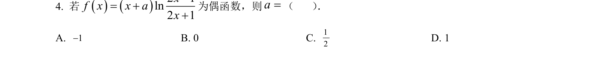
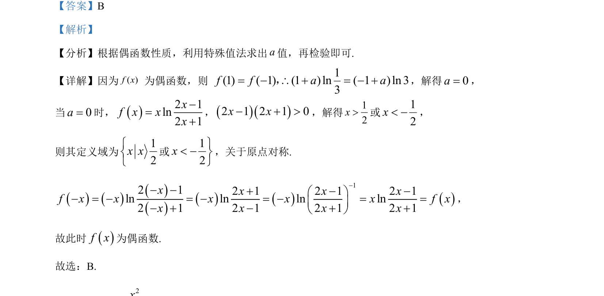

## 题面

## 摘要

考查偶函数性质求参数，利用特殊值法及定义域对称性进行检验。

## 关联考点

- [[658-偶函数性质|偶函数性质]]
- [[1116-赋值|特殊值法]]
- [[014-对称|定义域对称性]]
- [[832-对数运算|对数运算]]

## 答案与解析

> 📄 原 PDF 第 2 页：`素材/真题/吉林/2008-2024·（吉林）数学高考真题/2023年高考数学试卷（新课标Ⅱ卷）（解析卷）.pdf`

<!-- 题干文本-start -->
## 题干文本
4. 若()()21ln21xfxxax−=++
为偶函数，则=a（    ） ．
A. 1−B. 0 C. 12D. 1
<!-- 题干文本-end -->

<!-- 解析文本-start -->
## 解析文本
【答案】B
【解析】
【分析】根据偶函数性质，利用特殊值法求出a值，再检验即可.
【详解】因为( )f x 为偶函数，则 1(1) ( 1) (1 ) ln ( 1 ) ln 33f f a a= − \ + = − +，，解得0a=，
当0a=时，()2 1ln2 1xxxf x−=+
，()()2 1 2 1 0x x− + >，解得12x>或12x< −，
则其定义域为12x xìíî
或12xü< −ýþ
，关于原点对称.
()()()()()()()12 12 1 2 1 2 1ln ln ln ln2 1 2 1 2 1 2 1f xx x x xxx x xfx x x xx−− −+ö− = −− −æ= = = =ç ÷− + − + +è−ø− ，
故此时()f x为偶函数.
故选：B.
<!-- 解析文本-end -->
