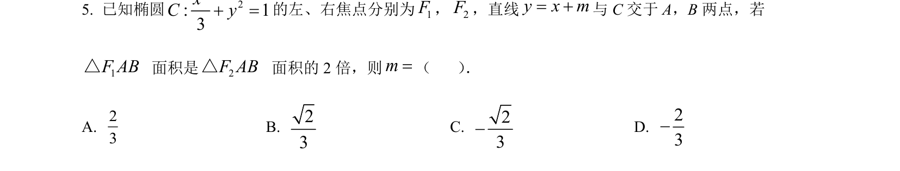
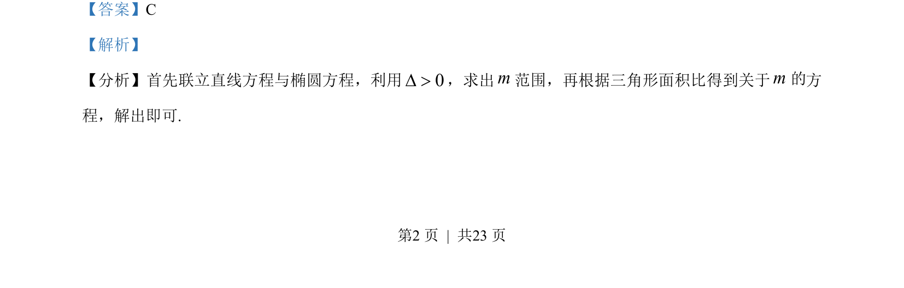
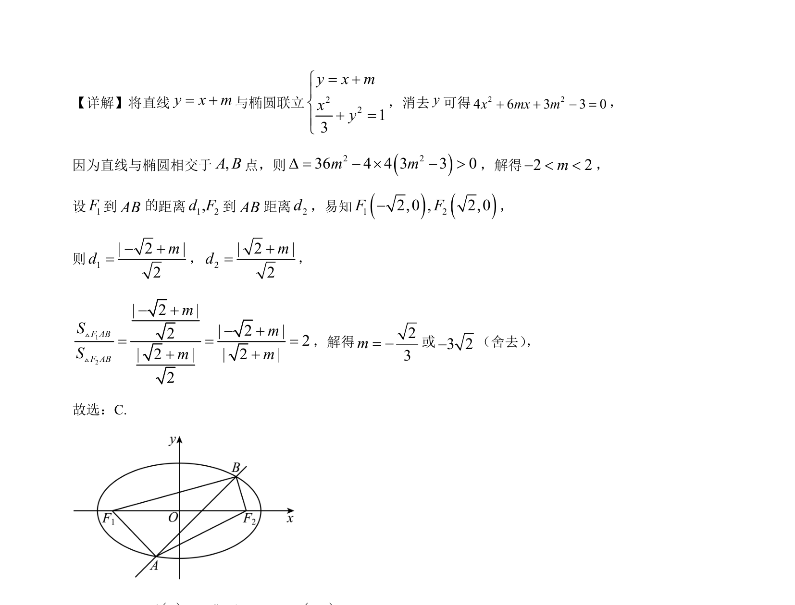

## 题面

## 摘要

直线与椭圆联立，通过判别式求参数范围，结合三角形面积比解出参数值。

## 关联考点

- [[941-椭圆标准方程|椭圆标准方程]]
- [[015-位置|直线与椭圆的位置关系]]
- [[570-点到直线的距离公式|点到直线的距离公式]]
- [[062-多边形面积|三角形面积]]

## 答案与解析

> 📄 原 PDF 第 2 页：`素材/真题/吉林/2008-2024·（吉林）数学高考真题/2023年高考数学试卷（新课标Ⅱ卷）（解析卷）.pdf`
