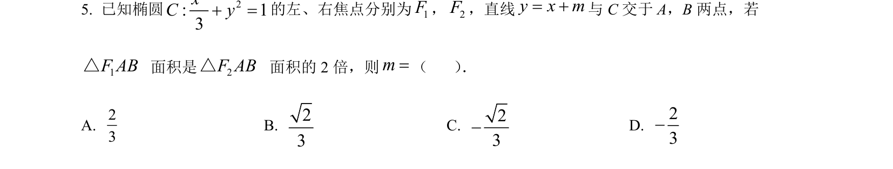
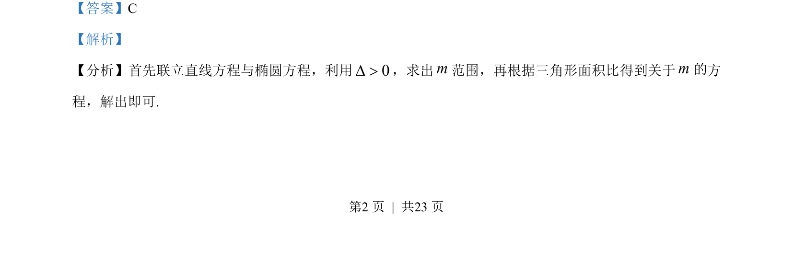
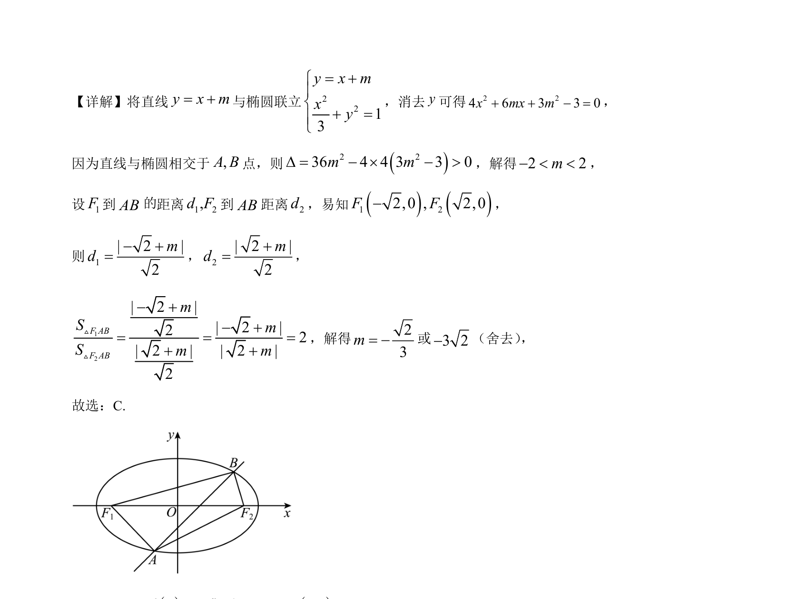

## 题面

## 摘要

直线与椭圆联立，通过判别式求参数范围，结合三角形面积比解出参数值。

## 关联考点

- [[941-椭圆标准方程|椭圆标准方程]]
- [[015-位置|直线与椭圆的位置关系]]
- [[570-点到直线的距离公式|点到直线的距离公式]]
- [[062-多边形面积|三角形面积]]

## 答案与解析

> 📄 原 PDF 第 2 页：`素材/真题/吉林/2008-2024·（吉林）数学高考真题/2023年高考数学试卷（新课标Ⅱ卷）（解析卷）.pdf`

<!-- 题干文本-start -->
## 题干文本
5. 已知椭圆
22: 13xC y =的左、右焦点分别为1F，2F，直线y x m= 与 C交于 A，B两点，若
1F AB△面积是2F AB△面积的 2 倍，则m=（    ） ．
A. 23B. 23
C. 23D. 23
<!-- 题干文本-end -->

<!-- 解析文本-start -->
## 解析文本
【答案】C
【解析】
【分析】首先联立直线方程与椭圆方程，利用0D >，求出m范围，再根据三角形面积比得到关于m方
程，解出即可.
的
<!-- 解析文本-end -->
