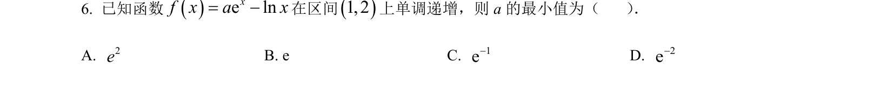
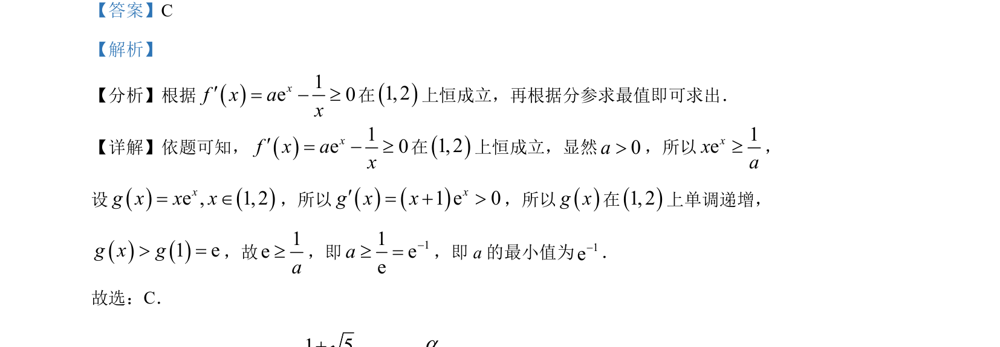

## 题面

## 摘要

已知函数导数不等式在区间上恒成立，利用参数分离法构造函数并求最值，进而求得参数的最小值。

## 关联考点

- [[705-利用导数研究函数的单调性|导数与单调性]]
- [[450-恒成立问题|恒成立问题]]
- [[720-参数分离|参数分离]]
- [[419-函数最值-高中|函数最值]]

## 答案与解析

> 📄 原 PDF 第 3 页：`素材/真题/吉林/2008-2024·（吉林）数学高考真题/2023年高考数学试卷（新课标Ⅱ卷）（解析卷）.pdf`
