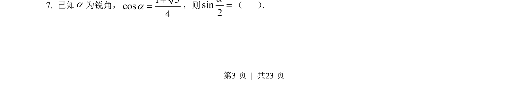
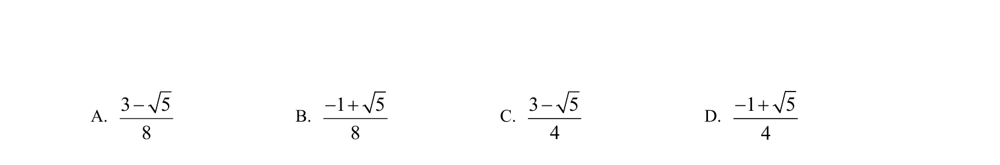
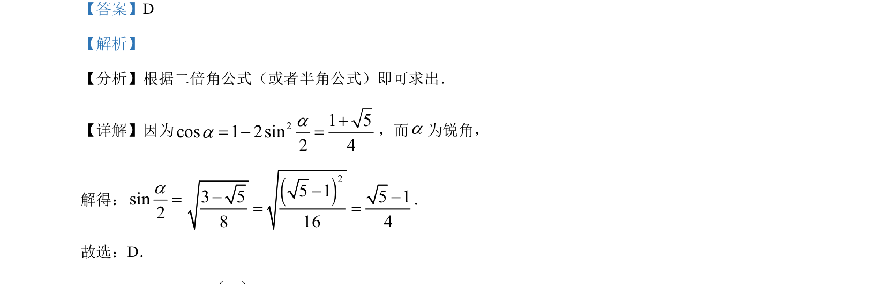

## 题面

## 摘要

本题考查利用二倍角公式或半角公式求锐角半角的正弦值，通过代数运算得出结果。

## 关联考点

- [[637-二倍角公式|二倍角公式]]
- [[717-半角公式|半角公式]]
- [[741-同角三角函数基本关系|同角三角函数基本关系]]

## 答案与解析

> 📄 原 PDF 第 3 页：`素材/真题/吉林/2008-2024·（吉林）数学高考真题/2023年高考数学试卷（新课标Ⅱ卷）（解析卷）.pdf`
