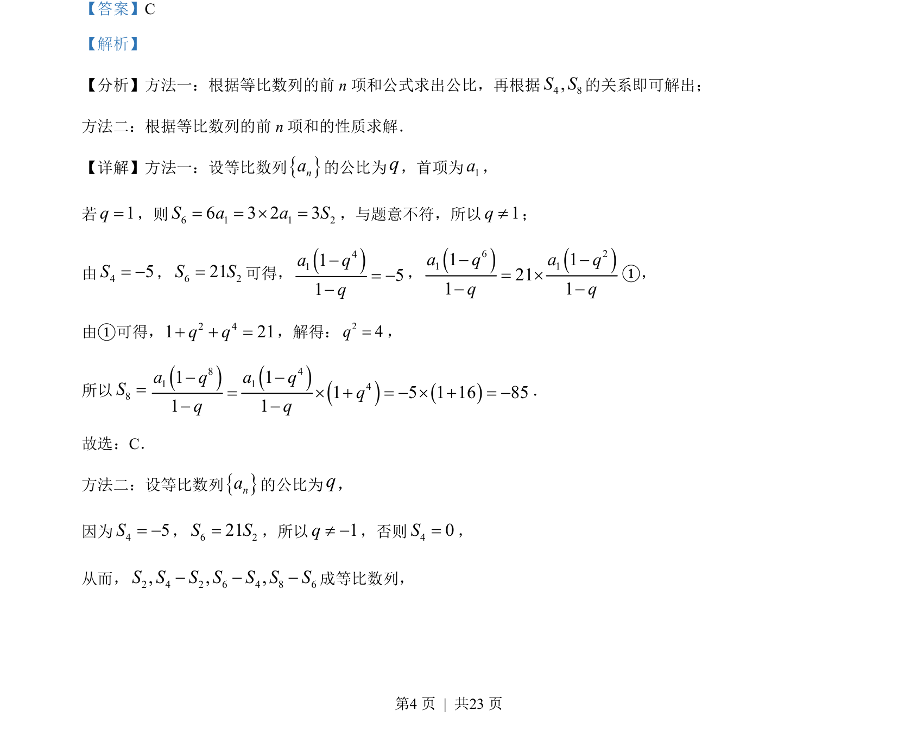
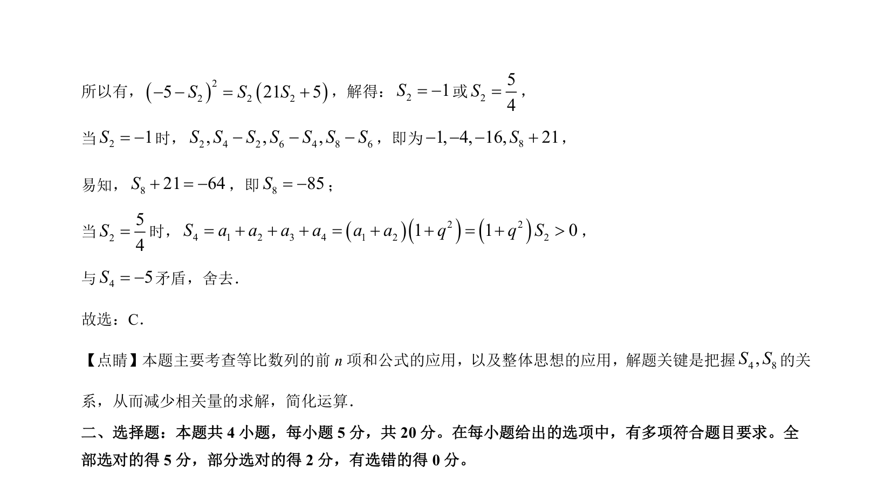

## 题面

## 摘要

本题主要考查等比数列的前n项和公式及性质，利用已知S₄、S₆与S₂的关系求S₈，体现整体代换思想。

## 关联考点

- [[358-等比数列概念|等比数列]]
- [[713-前n项和公式|前n项和公式]]
- [[1064-等比中项|等比中项]]
- [[557-整体思想|整体思想]]

## 答案与解析

> 📄 原 PDF 第 4 页：`素材/真题/吉林/2008-2024·（吉林）数学高考真题/2023年高考数学试卷（新课标Ⅱ卷）（解析卷）.pdf`
