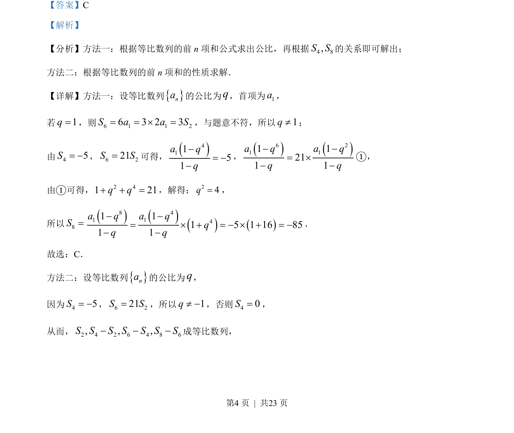
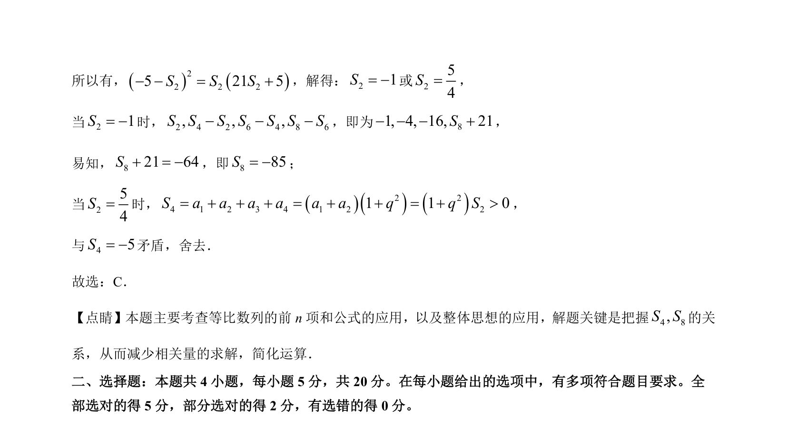

## 题面

## 摘要

本题主要考查等比数列的前n项和公式及性质，利用已知S₄、S₆与S₂的关系求S₈，体现整体代换思想。

## 关联考点

- [[358-等比数列概念|等比数列]]
- [[713-前n项和公式|前n项和公式]]
- [[1064-等比中项|等比中项]]
- [[557-整体思想|整体思想]]

## 答案与解析

> 📄 原 PDF 第 4 页：`素材/真题/吉林/2008-2024·（吉林）数学高考真题/2023年高考数学试卷（新课标Ⅱ卷）（解析卷）.pdf`

<!-- 题干文本-start -->
## 题干文本
8. 记nS为等比数列{}na的前 n 项和，若45S= −，6221SS=，则8S=（    ） ．
A. 120 B. 85 C. 85−D. 120−
<!-- 题干文本-end -->

<!-- 解析文本-start -->
## 解析文本
【答案】C
【解析】
【分析】方法一：根据等比数列的前 n 项和公式求出公比，再根据4 8,S S的关系即可解出；
方法二：根据等比数列的前 n 项和的性质求解．
【详解】方法一：设等比数列{}na的公比为q，首项为1a，
若1q=，则6 1 1 26 3 2 3S a a S= = ´ =，与题意不符，所以1q¹；
由45S= −，6221SS=可得，()41151a qq−= −−
，()()6 21 11 1211 1a q a qq q− −= ´− −
①，
由①可得，2 41 21q q+ + =，解得：24q=，
所以8S=()()()()8 41 141 11 5 1 16 851 1a q a qqq q− −= ´ + = − ´ + = −− −
．
故选：C．
方法二：设等比数列{}na的公比为q，
因为45S= −，6221SS=，所以1q¹ −，否则40S=，
从而，2 4 2 6 4 8 6, , ,S S S S S S S− − −成等比数列，
<!-- 解析文本-end -->
