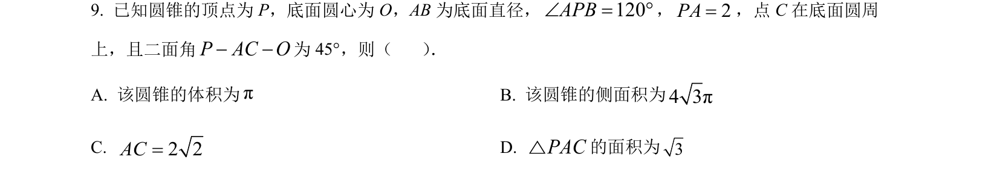
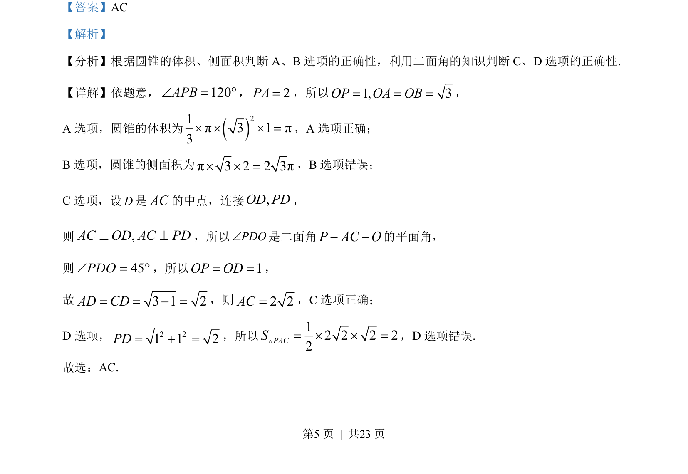
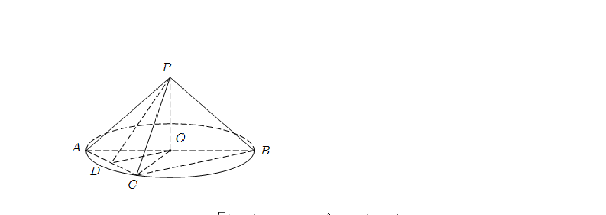

## 题面

## 摘要

考查圆锥的体积、侧面积计算及二面角的判断与应用。

## 关联考点

- [[079-圆锥|圆锥体积]]
- [[783-圆锥侧面积|圆锥侧面积]]
- [[353-空间角|二面角]]

## 答案与解析

> 📄 原 PDF 第 5 页：`素材/真题/吉林/2008-2024·（吉林）数学高考真题/2023年高考数学试卷（新课标Ⅱ卷）（解析卷）.pdf`

<!-- 题干文本-start -->
## 题干文本
9. 已知圆锥的顶点为 P，底面圆心为 O，AB为底面直径，120APBÐ = °，2PA=，点 C在底面圆周
上，且二面角P AC O− −为 45°，则（    ） ．
A. 该圆锥的体积为πB. 该圆锥的侧面积为4 3π
C. 2 2AC=D. PAC△的面积为3
<!-- 题干文本-end -->

<!-- 解析文本-start -->
## 解析文本
【答案】AC
【解析】
【分析】根据圆锥的体积、侧面积判断 A、B选项的正确性，利用二面角的知识判断 C、D 选项的正确性.
【详解】依题意，120APBÐ = °，2PA=，所以1, 3OP OA OB= = =，
A 选项，圆锥的体积为()21π3 1π3´ ´ ´ =，A 选项正确；
B选项，圆锥的侧面积为π3 2 2 3π´ ´ =，B选项错误；
C选项，设D是AC的中点，连接,OD PD，
则 ,AC OD AC PD^ ^，所以PDOÐ是二面角P AC O− −的平面角，
则 45PDOÐ = °，所以 1OP OD= =，
故 3 1 2AD CD= = − =，则2 2AC=，C选项正确；
D 选项， 2 21 1 2PD= + =，所以12 2 2 22PACS= ´ ´ =V，D 选项错误.
故选：AC.
<!-- 解析文本-end -->
