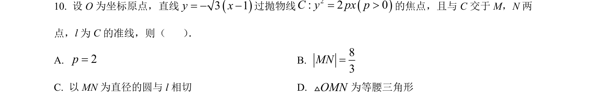
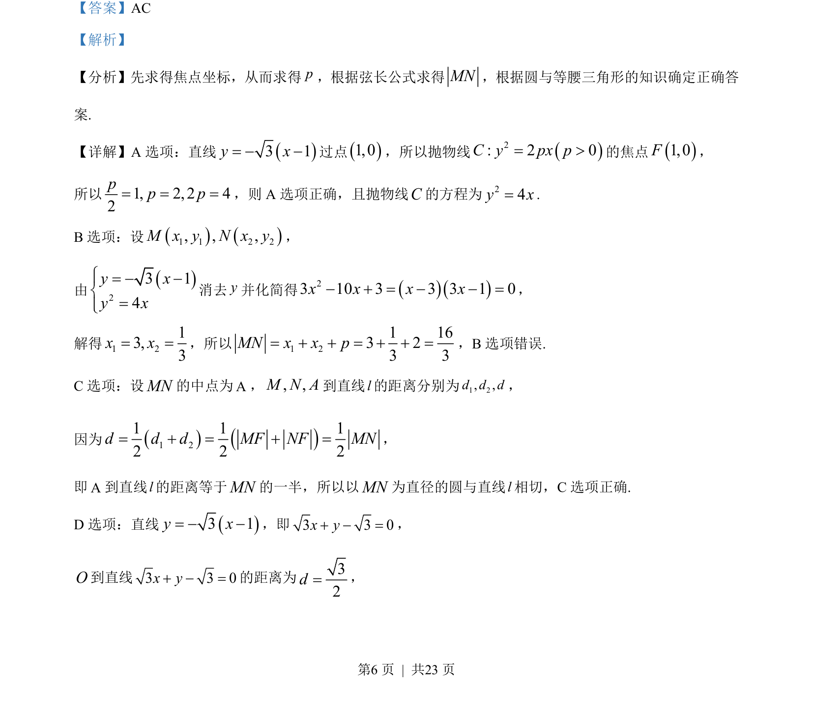
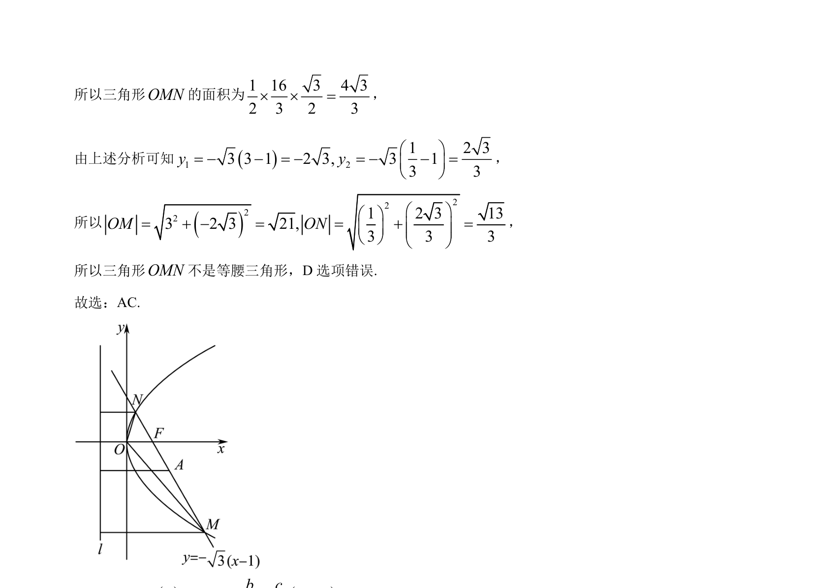

## 题面

## 摘要

抛物线焦点与弦长计算，结合圆与等腰三角形的几何性质判断选项正误

## 关联考点

- [[876-抛物线焦点|抛物线焦点]]
- [[867-弦长公式|弦长公式]]
- [[1016-直线与抛物线位置关系|直线与抛物线位置关系]]
- [[777-圆的几何性质|圆的几何性质]]

## 答案与解析

> 📄 原 PDF 第 6 页：`素材/真题/吉林/2008-2024·（吉林）数学高考真题/2023年高考数学试卷（新课标Ⅱ卷）（解析卷）.pdf`
