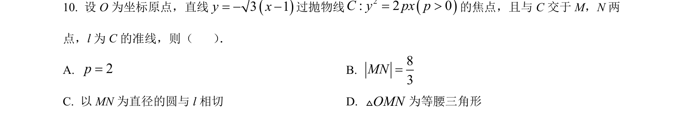
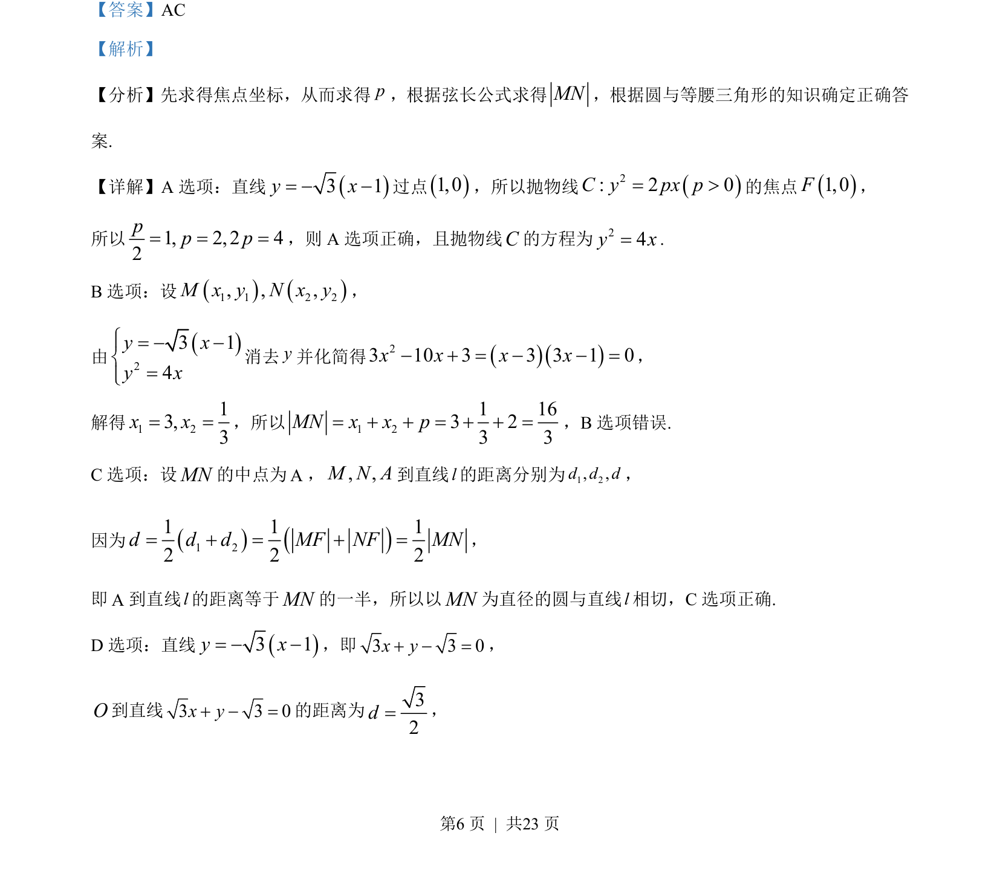
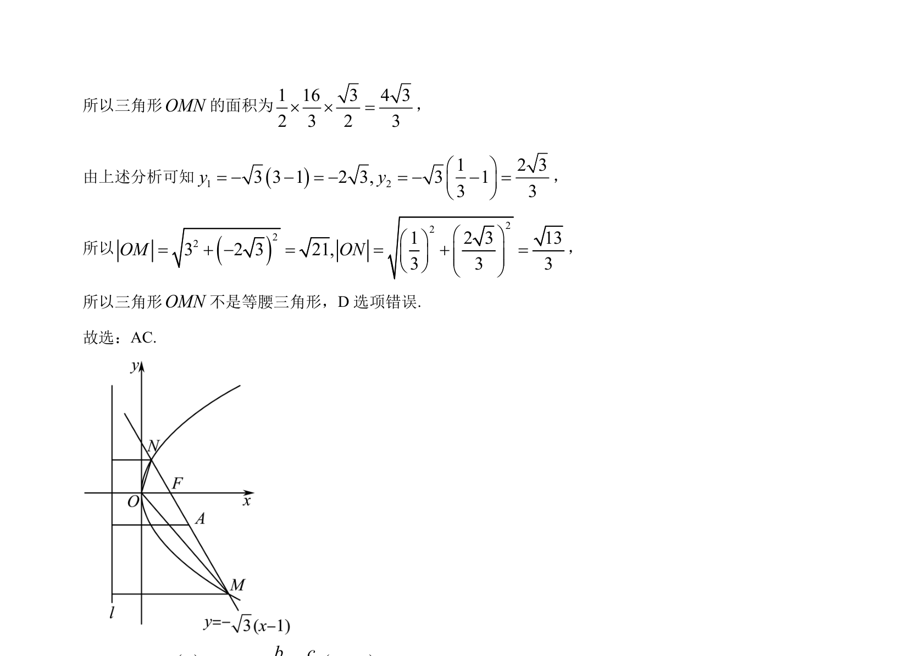

## 题面

## 摘要

抛物线焦点与弦长计算，结合圆与等腰三角形的几何性质判断选项正误

## 关联考点

- [[876-抛物线焦点|抛物线焦点]]
- [[867-弦长公式|弦长公式]]
- [[1016-直线与抛物线位置关系|直线与抛物线位置关系]]
- [[777-圆的几何性质|圆的几何性质]]

## 答案与解析

> 📄 原 PDF 第 6 页：`素材/真题/吉林/2008-2024·（吉林）数学高考真题/2023年高考数学试卷（新课标Ⅱ卷）（解析卷）.pdf`

<!-- 题干文本-start -->
## 题干文本
10. 设 O 为坐标原点，直线()3 1y x= − −过抛物线()2: 2 0C y px p= >的焦点，且与 C交于 M，N两
点，l为 C的准线，则（    ） ．
A. 2p= B. 83MN=
C. 以 MN为直径的圆与 l相切 D. OMNV为等腰三角形
<!-- 题干文本-end -->

<!-- 解析文本-start -->
## 解析文本
【答案】AC
【解析】
【分析】先求得焦点坐标，从而求得p，根据弦长公式求得MN，根据圆与等腰三角形的知识确定正确答
案.
【详解】A 选项：直线()3 1y x= − −过点()1,0，所以抛物线()2: 2 0C y px p= >的焦点()1,0F，
所以1, 2, 2 42pp p= = =，则 A 选项正确，且抛物线C的方程为24y x=.
B选项：设()()1 1 2 2, , ,M x y N x y，
由()23 14y xy xì= − −ïí=ïî
消去y并化简得 ()()23 10 3 3 3 1 0x x x x− + = − − =，
解得1 213,3x x= =，所以 1 21 163 23 3MN x x p= + + = + + =，B选项错误.
C选项：设MN的中点为A，, ,M N A到直线l的距离分别为1 2, ,d d d，
因为()()1 21 1 12 2 2d d d MF NF MN= + = + =，
即A到直线l的距离等于MN的一半，所以以MN为直径的圆与直线l相切，C选项正确.
D 选项：直线()3 1y x= − −，即3 3 0x y+ − =，
O到直线3 3 0x y+ − =的距离为32d=，
<!-- 解析文本-end -->
