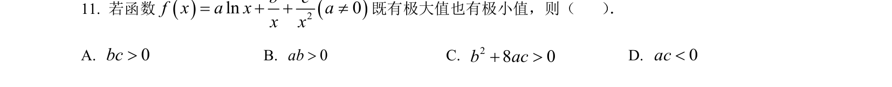
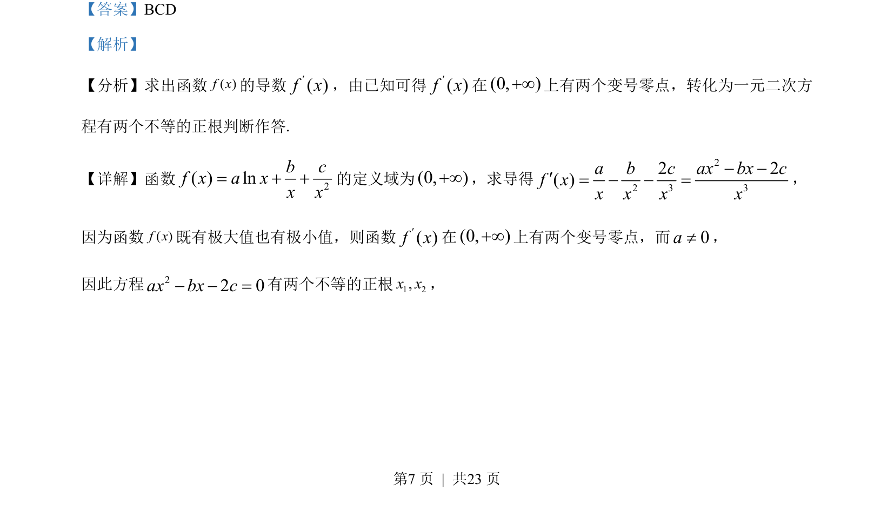
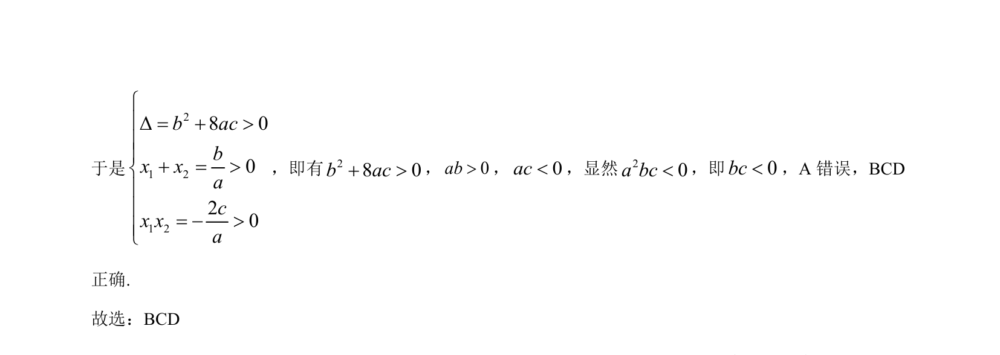

## 题面

## 摘要

利用导数研究函数极值的存在性，转化为二次方程正根的判别条件。

## 关联考点

- [[548-导数与极值|导数与极值]]
- [[642-二次方程根的分布|二次方程根的分布]]
- [[234-韦达定理-初中|韦达定理]]

## 答案与解析

> 📄 原 PDF 第 7 页：`素材/真题/吉林/2008-2024·（吉林）数学高考真题/2023年高考数学试卷（新课标Ⅱ卷）（解析卷）.pdf`
