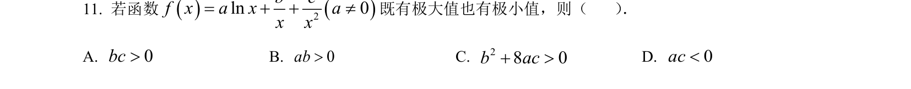
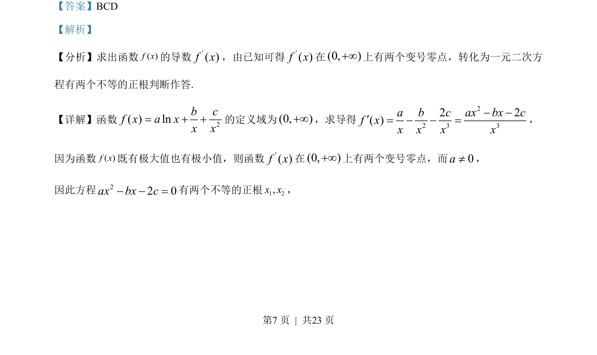
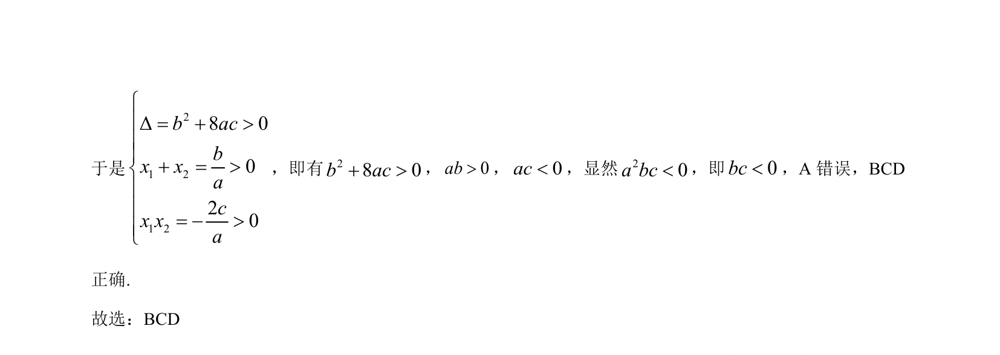

## 题面

## 摘要

利用导数研究函数极值的存在性，转化为二次方程正根的判别条件。

## 关联考点

- [[548-导数与极值|导数与极值]]
- [[642-二次方程根的分布|二次方程根的分布]]
- [[234-韦达定理-初中|韦达定理]]

## 答案与解析

> 📄 原 PDF 第 7 页：`素材/真题/吉林/2008-2024·（吉林）数学高考真题/2023年高考数学试卷（新课标Ⅱ卷）（解析卷）.pdf`

<!-- 题干文本-start -->
## 题干文本
11. 若函数()()2ln0bcfxaxaxx=++¹既有极大值也有极小值，则（    ） ．
A. 0bc>B. 0ab>C. 280bac+>D. 0ac<
<!-- 题干文本-end -->

<!-- 解析文本-start -->
## 解析文本
【答案】BCD
【解析】
【分析】求出函数( )f x的导数( )f x¢，由已知可得( )f x¢在(0, )+¥上有两个变号零点，转化为一元二次方
程有两个不等的正根判断作答.
【详解】函数 2( ) lnb cf x a xx x= + +的定义域为(0, )+¥，求导得
22 3 32 2( )a b c ax bx cf xx x x x− −¢= − − =，
因为函数( )f x既有极大值也有极小值，则函数( )f x¢在(0, )+¥上有两个变号零点，而0a¹，
因此方程22 0ax bx c− − =有两个不等的正根1 2,x x，
<!-- 解析文本-end -->
