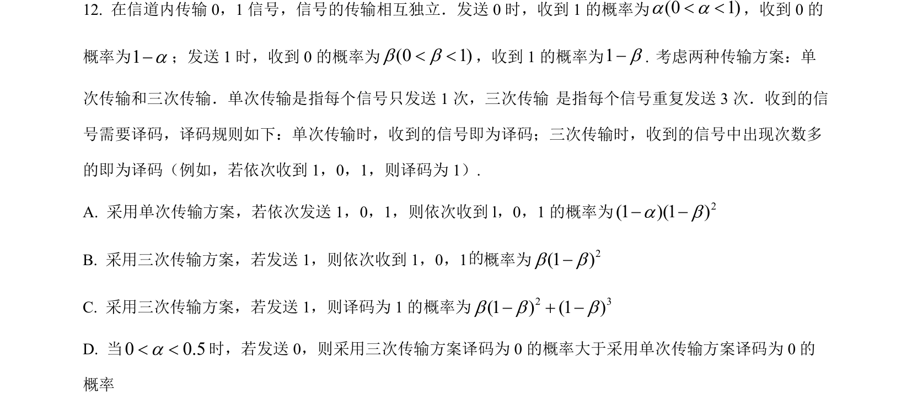
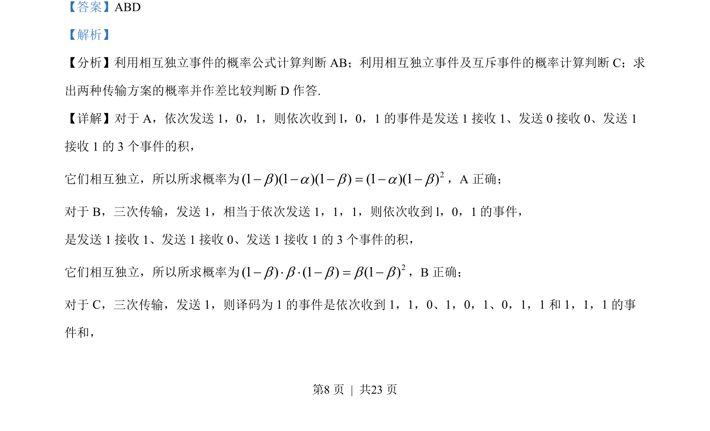
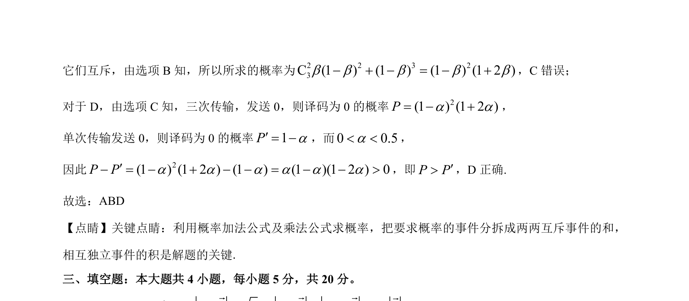

## 题面

## 摘要

考查相互独立事件与互斥事件的概率计算，以及传输方案译码正确率的比较。

## 关联考点

- [[468-事件相互独立性-高中|相互独立事件]]
- [[317-事件的关系运算|互斥事件]]
- [[947-概率乘法公式|概率乘法公式]]
- [[948-概率加法公式|概率加法公式]]

## 答案与解析

> 📄 原 PDF 第 8 页：`素材/真题/吉林/2008-2024·（吉林）数学高考真题/2023年高考数学试卷（新课标Ⅱ卷）（解析卷）.pdf`
