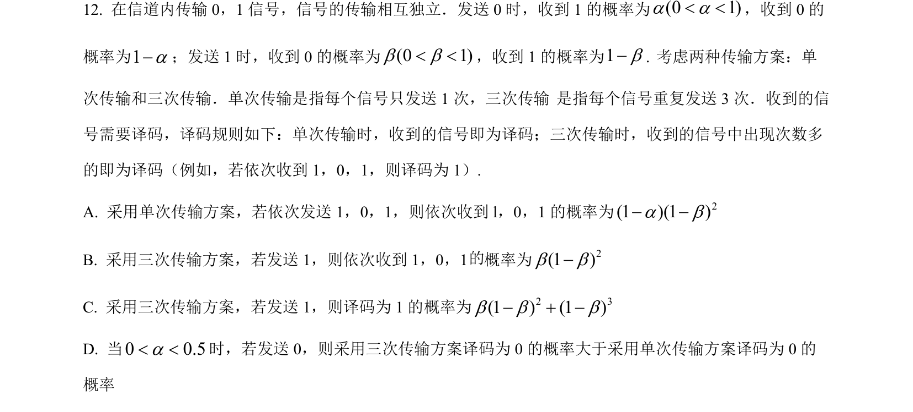
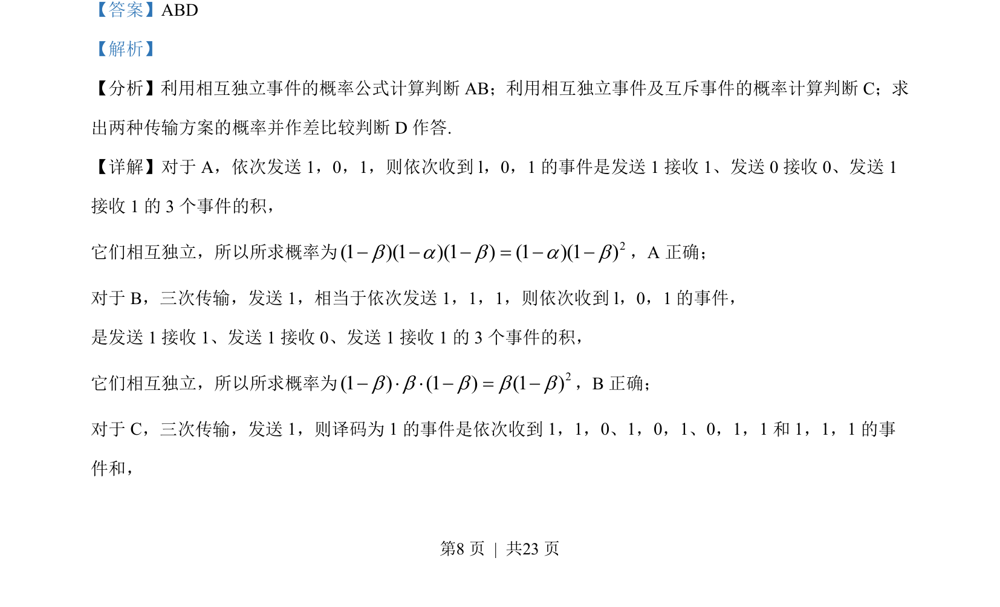
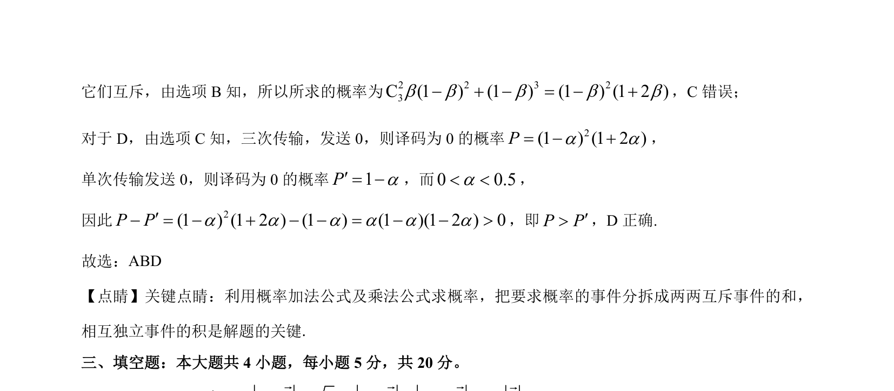

## 题面

## 摘要

考查相互独立事件与互斥事件的概率计算，以及传输方案译码正确率的比较。

## 关联考点

- [[468-事件相互独立性-高中|相互独立事件]]
- [[317-事件的关系运算|互斥事件]]
- [[946-概率乘法公式|概率乘法公式]]
- [[947-概率加法公式|概率加法公式]]

## 答案与解析

> 📄 原 PDF 第 8 页：`素材/真题/吉林/2008-2024·（吉林）数学高考真题/2023年高考数学试卷（新课标Ⅱ卷）（解析卷）.pdf`

<!-- 题干文本-start -->
## 题干文本
12. 在信道内传输 0，1 信号，信号的传输相互独立．发送 0 时，收到 1 的概率为(0 1)a a< <，收到 0 的
概率为1a−；发送 1 时，收到 0 的概率为(0 1)b b< <，收到 1 的概率为1b−. 考虑两种传输方案：单
次传输和三次传输．单次传输是指每个信号只发送 1 次，三次传输 是指每个信号重复发送 3 次．收到的信
号需要译码，译码规则如下：单次传输时，收到的信号即为译码；三次传输时，收到的信号中出现次数多
的即为译码（例如，若依次收到 1，0，1，则译码为 1）.
A. 采用单次传输方案，若依次发送 1，0，1，则依次收到 l，0，1 的概率为 2(1 )(1 )a b− −
B. 采用三次传输方案，若发送 1，则依次收到 1，0，1 概率为 2(1 )b b−
C. 采用三次传输方案，若发送 1，则译码为 1 的概率为 2 3(1 ) (1 )b b b− + −
D. 当00.5a<<时，若发送 0，则采用三次传输方案译码为 0 的概率大于采用单次传输方案译码为 0 的
概率
<!-- 题干文本-end -->

<!-- 解析文本-start -->
## 解析文本
【答案】ABD
【解析】
【分析】利用相互独立事件的概率公式计算判断 AB；利用相互独立事件及互斥事件的概率计算判断 C；求
出两种传输方案的概率并作差比较判断 D 作答.
【详解】对于 A，依次发送 1，0，1，则依次收到 l，0，1 的事件是发送 1 接收 1、发送 0 接收 0、发送 1
接收 1 的 3 个事件的积，
它们相互独立，所以所求概率为 2(1 )(1 )(1 ) (1 )(1 )b a b a b− − − = − −，A 正确；
对于 B，三次传输，发送 1，相当于依次发送 1，1，1，则依次收到 l，0，1 的事件，
是发送 1 接收 1、发送 1 接收 0、发送 1 接收 1 的 3 个事件的积，
它们相互独立，所以所求概率为 2(1 ) (1 ) (1 )b b b b b− × × − = −，B正确；
对于 C，三次传输，发送 1，则译码为 1 的事件是依次收到 1，1，0、1，0，1、0，1，1 和 1，1，1 的事
件和，
的
<!-- 解析文本-end -->
