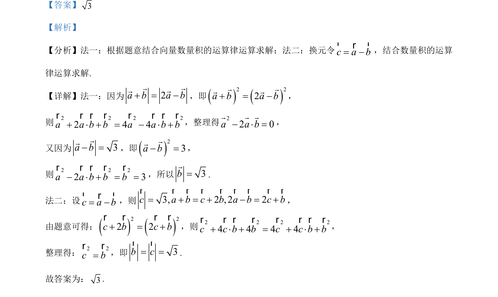

## 题面

## 摘要

该题考查利用向量数量积的运算律求解向量的模，涉及两种方法转化条件求解。

## 关联考点

- [[751-向量数量积|向量数量积]]
- [[752-向量模长|向量的模]]
- [[1165-向量运算律|向量运算律]]

## 答案与解析

> 📄 原 PDF 第 9 页：`素材/真题/吉林/2008-2024·（吉林）数学高考真题/2023年高考数学试卷（新课标Ⅱ卷）（解析卷）.pdf`
