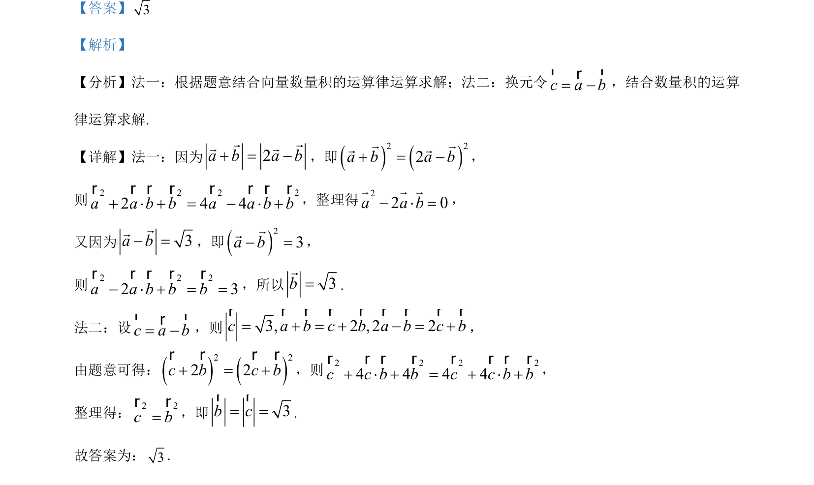

## 题面

## 摘要

该题考查利用向量数量积的运算律求解向量的模，涉及两种方法转化条件求解。

## 关联考点

- [[328-向量的数量积|向量数量积]]
- [[752-向量模长|向量的模]]
- [[1164-向量运算律|向量运算律]]

## 答案与解析

> 📄 原 PDF 第 9 页：`素材/真题/吉林/2008-2024·（吉林）数学高考真题/2023年高考数学试卷（新课标Ⅱ卷）（解析卷）.pdf`

<!-- 题干文本-start -->
## 题干文本
13. 已知向量ar，br
满足 3a b− =rr，2a b a b+ = −r rr r，则b=r
______．
<!-- 题干文本-end -->

<!-- 解析文本-start -->
## 解析文本
【答案】3
【解析】
【分析】法一：根据题意结合向量数量积的运算律运算求解；法二：换元令c a b= −rrr，结合数量积的运算
律运算求解.
【详解】法一：因为2a b a b+ = −r rr r，即()()2 22a b a b+ = −r rr r，
则2 2 2 22 4 4a a b b a a b b+ × + = − × +r r r r r r r r，整理得22 0a a b− × =r r r，
又因为 3a b− =rr，即()23a b− =rr，
则2 2 22 3a a b b b− × + = =r r r r r，所以3b=r
.
法二：设c a b= −rrr，则3, 2 , 2 2c a b c b a b c b= + = + − = +r r r r r r r r r
，
由题意可得：()()2 22 2c b c b+ = +r r r r
，则2 2 2 24 4 4 4c c b b c c b b+ × + = + × +r r r r r r r r，
整理得：2 2c b=r r，即 3b c= =rr
.
故答案为：3.
<!-- 解析文本-end -->
