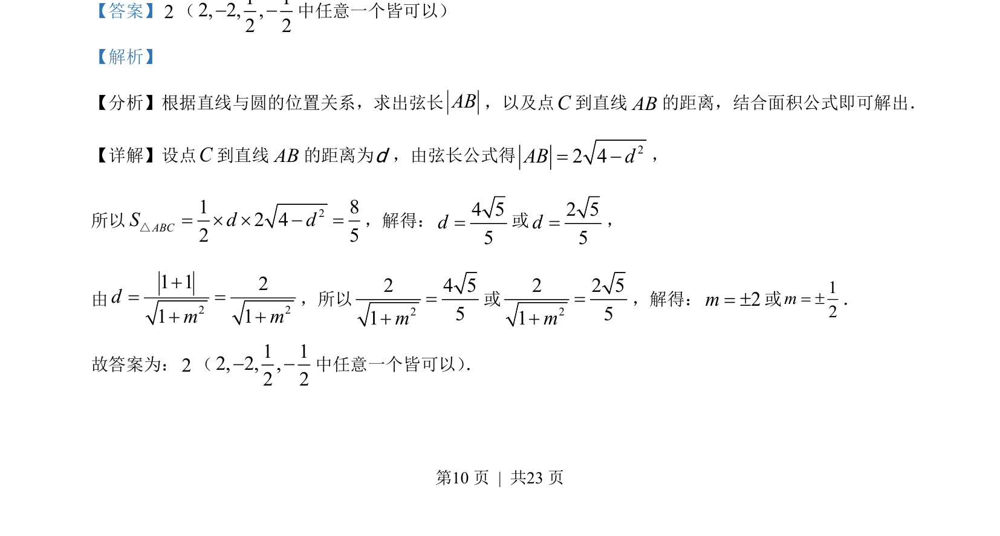

## 题面

## 摘要

该题考查直线与圆相交的弦长、点到直线距离及三角形面积，求参数。

## 关联考点

- [[394-直线和圆位置关系-高中|直线与圆的位置关系]]
- [[点到直线的距离公式]]
- [[弦长公式]]
- [[062-多边形面积|三角形面积]]

## 答案与解析

> 📄 原 PDF 第 10 页：`素材/真题/吉林/2008-2024·（吉林）数学高考真题/2023年高考数学试卷（新课标Ⅱ卷）（解析卷）.pdf`
