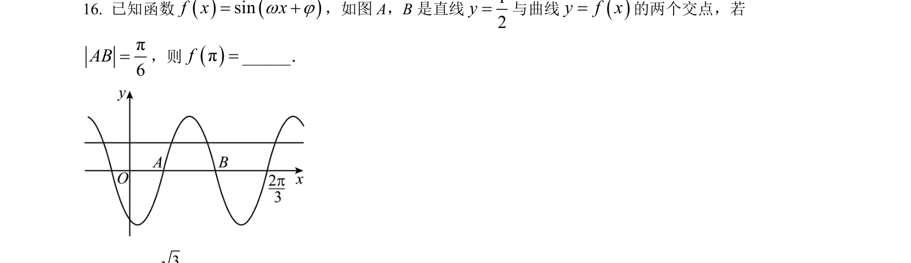
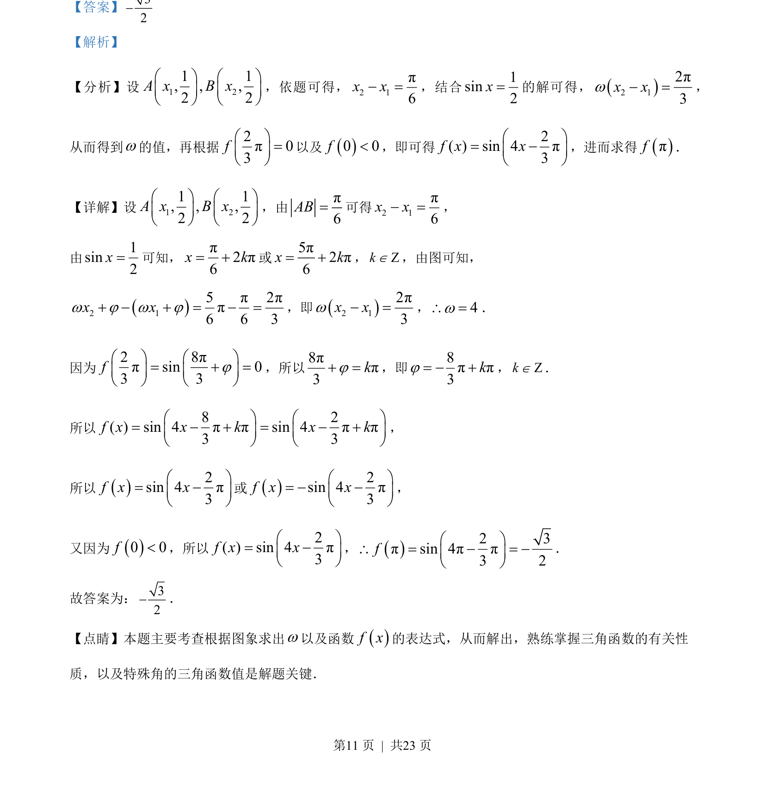
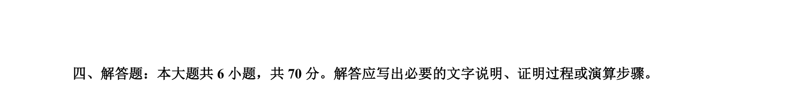

## 题面

## 摘要

根据三角函数图象求解析式参数并计算函数值。

## 关联考点

- [[612-三角函数的图像与性质|三角函数的图象与性质]]
- [[998-由图象求解析式|由图象求解析式]]
- [[253-特殊角三角函数值|特殊角的三角函数值]]

## 答案与解析

> 📄 原 PDF 第 11 页：`素材/真题/吉林/2008-2024·（吉林）数学高考真题/2023年高考数学试卷（新课标Ⅱ卷）（解析卷）.pdf`

<!-- 题干文本-start -->
## 题干文本
16. 已知函数sinf x xw j= ，如图 A，B是直线12y=与曲线y f x=的两个交点，若
π6AB=，则πf=______．
<!-- 题干文本-end -->

<!-- 解析文本-start -->
## 解析文本
【答案】32
【解析】
【分析】设1 21 1, , ,2 2A x B xæ ö æ öç ÷ ç ÷è ø è ø
，依题可得，2 1π6x x =，结合1sin2x=的解可得，2 12π3x xw =，
从而得到w的值，再根据
2π03fæ ö=ç ÷è ø
以及0 0f<，即可得
2( ) sin 4π3f x xæ ö= ç ÷è ø
，进而求得πf．
【详解】设1 21 1, , ,2 2A x B xæ ö æ öç ÷ ç ÷è ø è ø
，由π6AB=可得2 1π6x x =，
由1sin2x=可知，π2π6x k= 或5π2π6x k= ，ZkÎ，由图可知，
2 15π2ππ6 6 3x xw j w j   =  =，即2 12π3x xw =，4w\ =．
因为
2 8ππsin 03 3fjæ ö æ ö=  =ç ÷ ç ÷è ø è ø
，所以8ππ3kj =，即8ππ3kj=  ，ZkÎ．
所以
8 2( ) sin 4ππsin 4ππ3 3f x x k x kæ ö æ ö=   =  ç ÷ ç ÷è ø è ø
，
所以2sin 4π3f x xæ ö= ç ÷è ø
或2sin 4π3f x xæ ö=  ç ÷è ø
，
又因为0 0f<，所以
2( ) sin 4π3f x xæ ö= ç ÷è ø
，2 3πsin 4ππ3 2fæ ö\ =  = ç ÷è ø
．
故答案为：32．
【点睛】本题主要考查根据图象求出w以及函数f x的表达式，从而解出，熟练掌握三角函数的有关性
质，以及特殊角的三角函数值是解题关键．
<!-- 解析文本-end -->
