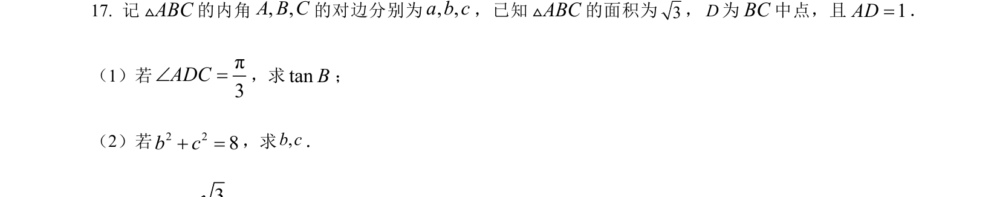
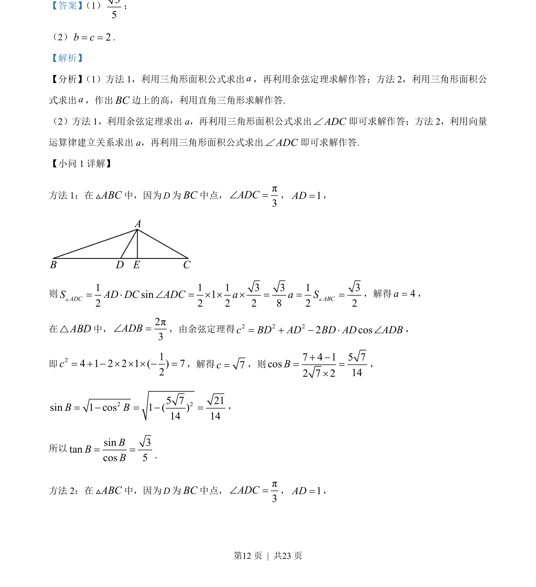
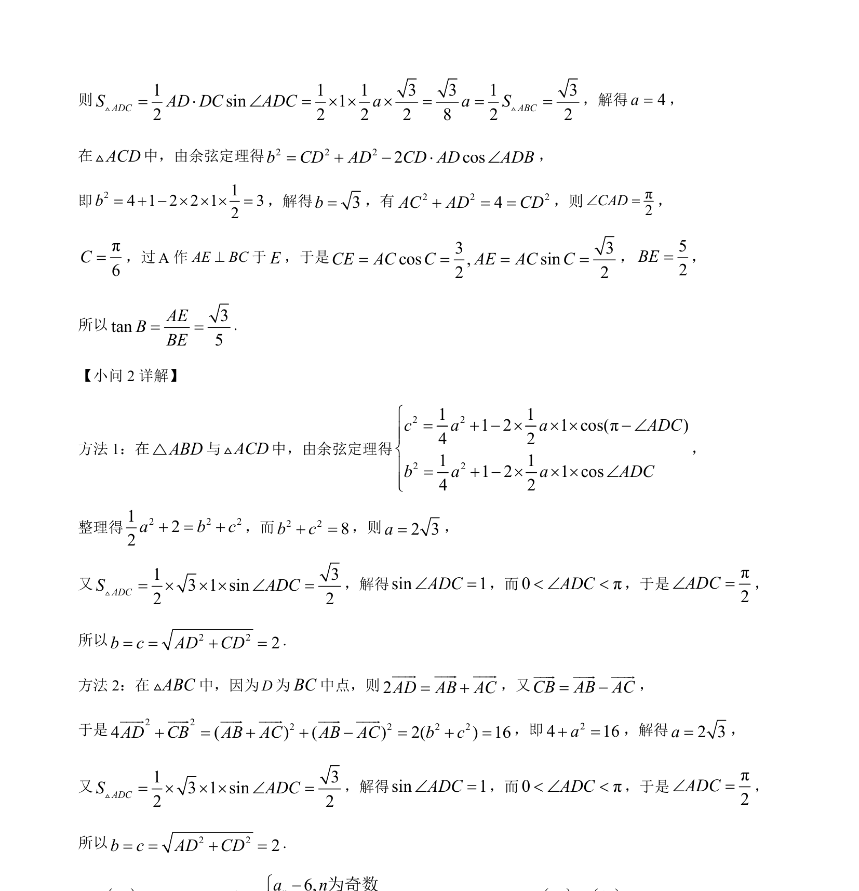

## 题面

## 摘要

本题考查解三角形中中线相关问题的解法，包括三角形面积公式、余弦定理及正弦定理的应用。

## 关联考点

- [[619-三角形面积公式|三角形面积公式]]
- [[126-定理|余弦定理]]
- [[126-定理|正弦定理]]

## 答案与解析

> 📄 原 PDF 第 12 页：`素材/真题/吉林/2008-2024·（吉林）数学高考真题/2023年高考数学试卷（新课标Ⅱ卷）（解析卷）.pdf`
