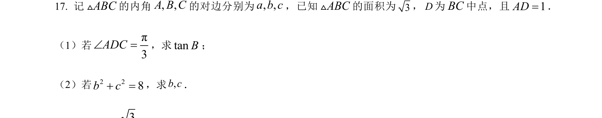
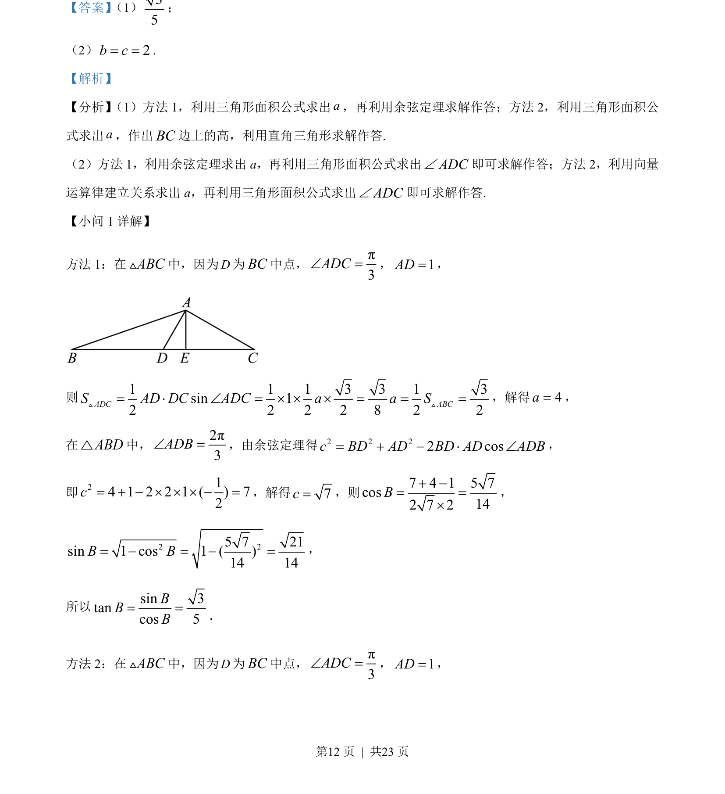
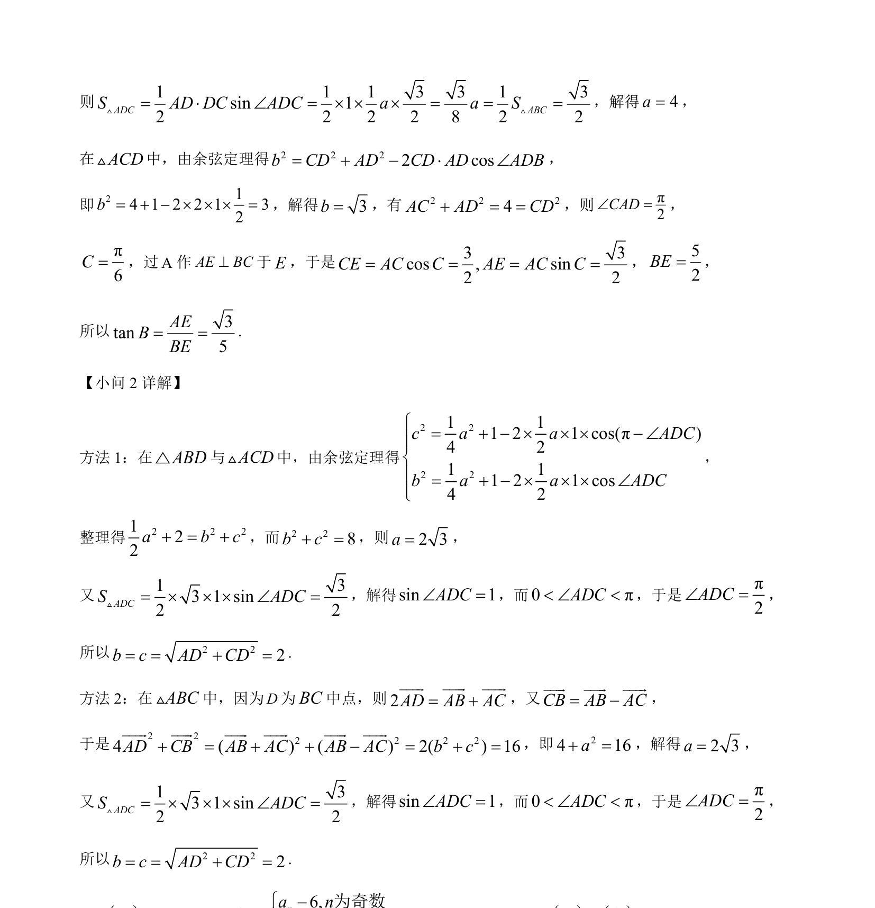

## 题面

## 摘要

本题考查解三角形中中线相关问题的解法，包括三角形面积公式、余弦定理及正弦定理的应用。

## 关联考点

- [[619-三角形面积公式|三角形面积公式]]
- [[126-定理|余弦定理]]
- [[126-定理|正弦定理]]

## 答案与解析

> 📄 原 PDF 第 12 页：`素材/真题/吉林/2008-2024·（吉林）数学高考真题/2023年高考数学试卷（新课标Ⅱ卷）（解析卷）.pdf`

<!-- 题干文本-start -->
## 题干文本
17. 记ABCV的内角, ,A B C的对边分别为, ,a b c，已知ABCV的面积为3，D为BC中点，且1AD=．
（1）若 π3ADCÐ =，求tanB；
（2）若2 28b c =，求,b c．
<!-- 题干文本-end -->

<!-- 解析文本-start -->
## 解析文本
【答案】 （1）35
；    
（2）2b c= =.
【解析】
【分析】 （1）方法 1，利用三角形面积公式求出a，再利用余弦定理求解作答；方法 2，利用三角形面积公
式求出a，作出BC边上的高，利用直角三角形求解作答.
（2）方法 1，利用余弦定理求出 a，再利用三角形面积公式求出ADCÐ即可求解作答；方法 2，利用向量
运算律建立关系求出 a，再利用三角形面积公式求出ADCÐ即可求解作答.
【小问 1 详解】
方法 1：在ABCV中，因为D为BC中点， π3ADCÐ =，1AD=，
  
则1 1 1 3 3 1 3sin 12 2 2 2 8 2 2ADC ABCS AD DC ADC a a S= × Ð = ´ ´ ´ = = =V V ，解得4a=，
在ABD△中，2π3ADBÐ =，由余弦定理得2 2 22 cosc BD AD BD AD ADB=   × Ð，
即214 1 2 2 1 ( ) 72c=   ´ ´ ´  =，解得7c=，则7 4 1 5 7cos142 7 2B = =´
，
2 25 7 21sin 1 cos 1 ( )14 14B B=  =  =，
所以sin 3tancos 5BBB= =
方法 2：在ABCV中，因为D为BC中点， π3ADCÐ =，1AD=，
.
<!-- 解析文本-end -->
