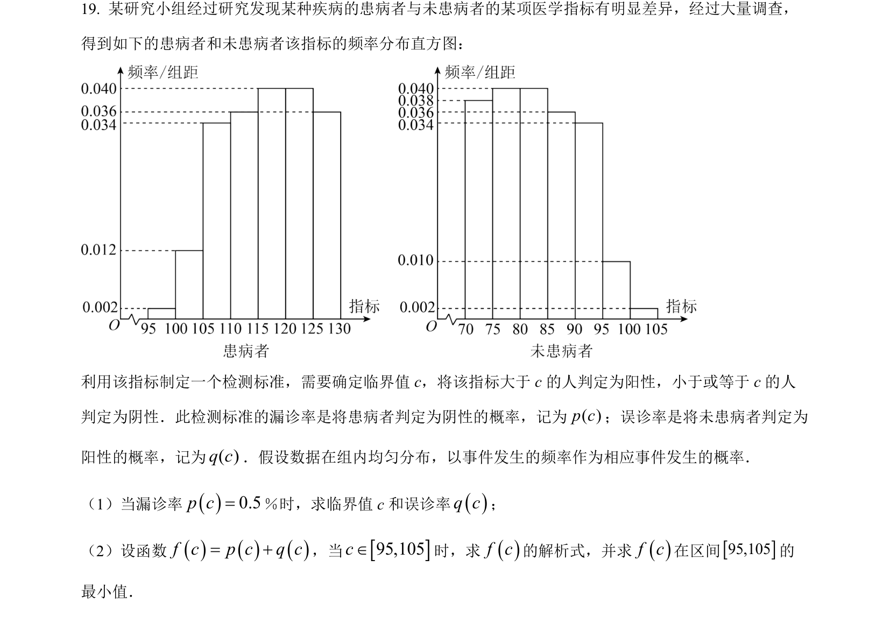
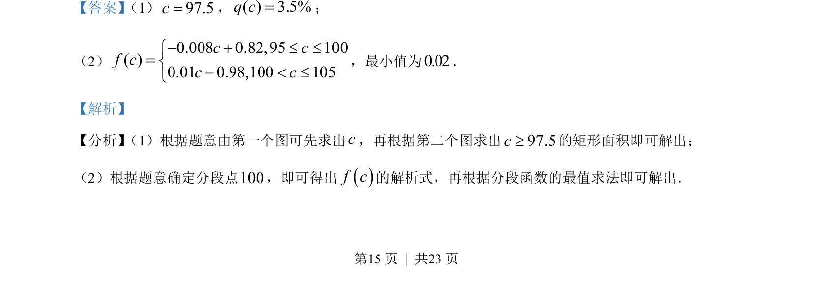
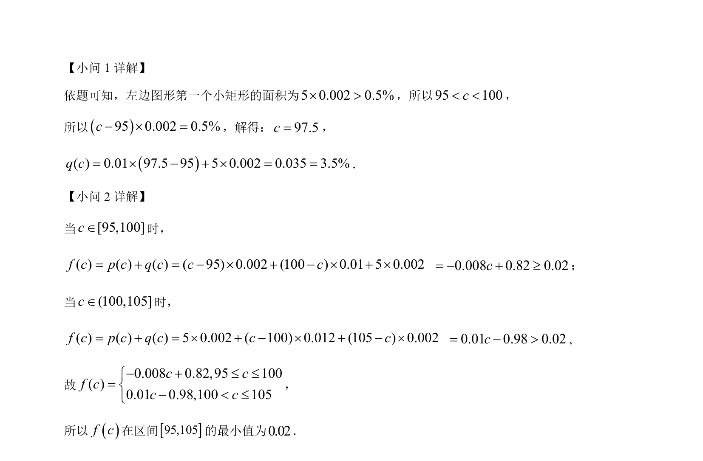

## 题面

## 摘要

本题通过频率分布直方图求参数并建立分段函数模型，进而求其最小值。

## 关联考点

- [[364-频率分布直方图|频率分布直方图]]
- [[290-分段函数|分段函数]]
- [[419-函数最值-高中|函数最值]]

## 答案与解析

> 📄 原 PDF 第 15 页：`素材/真题/吉林/2008-2024·（吉林）数学高考真题/2023年高考数学试卷（新课标Ⅱ卷）（解析卷）.pdf`
