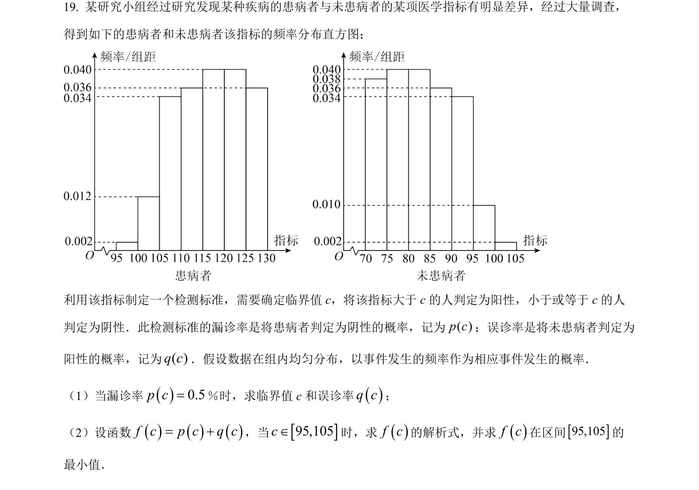
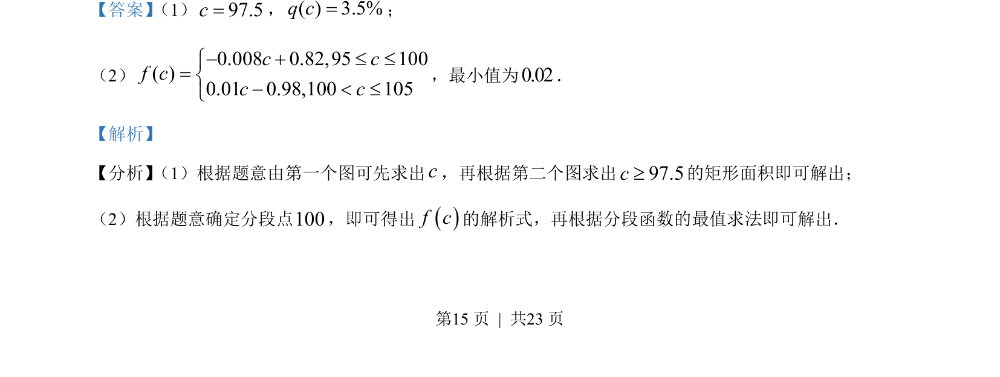
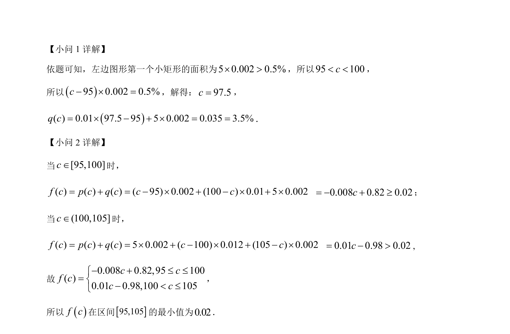

## 题面

## 摘要

本题通过频率分布直方图求参数并建立分段函数模型，进而求其最小值。

## 关联考点

- [[364-频率分布直方图|频率分布直方图]]
- [[290-分段函数|分段函数]]
- [[419-函数最值-高中|函数最值]]

## 答案与解析

> 📄 原 PDF 第 15 页：`素材/真题/吉林/2008-2024·（吉林）数学高考真题/2023年高考数学试卷（新课标Ⅱ卷）（解析卷）.pdf`

<!-- 题干文本-start -->
## 题干文本
19. 某研究小组经过研究发现某种疾病的患病者与未患病者的某项医学指标有明显差异，经过大量调查，
得到如下的患病者和未患病者该指标的频率分布直方图：
  
利用该指标制定一个检测标准，需要确定临界值 c，将该指标大于 c的人判定为阳性，小于或等于 c的人
判定为阴性．此检测标准的漏诊率是将患病者判定为阴性的概率，记为( )p c；误诊率是将未患病者判定为
阳性的概率，记为( )q c．假设数据在组内均匀分布，以事件发生的频率作为相应事件发生的概率．
（1）当漏诊率()0.5pc=％时，求临界值 c和误诊率()qc；
（2）设函数()()()fcpcqc=+，当[]95,105cÎ时，求()f c的解析式，并求()f c在区间[]95,105的
最小值．
<!-- 题干文本-end -->

<!-- 解析文本-start -->
## 解析文本
【答案】 （1）97.5c=，( ) 3.5%q c=；    
（2）
0.008 0.82,95 100( )0.01 0.98,100 105c cf cc c− + £ £ì=í− < £î
，最小值为0.02．
【解析】
【分析】 （1）根据题意由第一个图可先求出c，再根据第二个图求出97.5c³的矩形面积即可解出；
（2）根据题意确定分段点100，即可得出()f c的解析式，再根据分段函数的最值求法即可解出．
<!-- 解析文本-end -->
