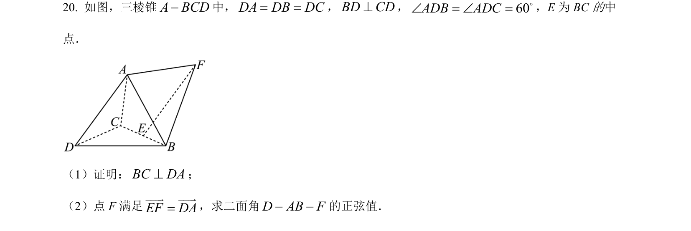
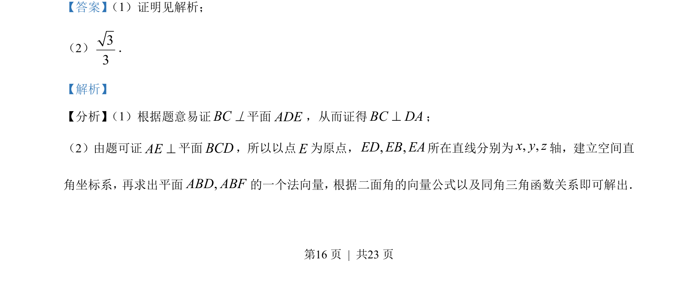
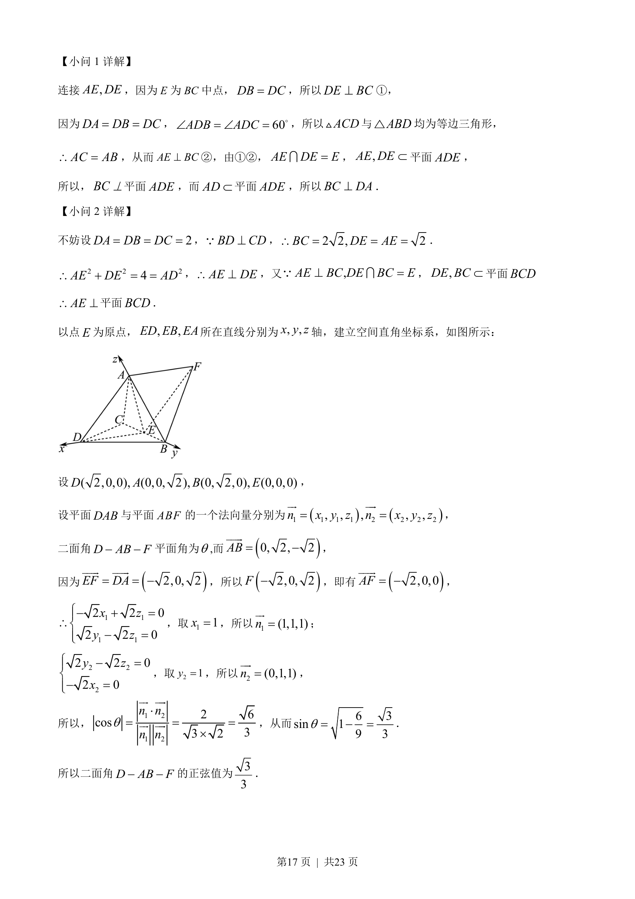

## 题面

## 摘要

本题考查线线垂直证明及利用空间向量求二面角的正弦值。

## 关联考点

- [[1084-线面垂直判定与性质|线面垂直判定与性质]]
- [[399-空间向量坐标表示|空间直角坐标系]]
- [[1192-二面角的向量求法|二面角的向量求法]]

## 答案与解析

> 📄 原 PDF 第 16 页：`素材/真题/吉林/2008-2024·（吉林）数学高考真题/2023年高考数学试卷（新课标Ⅱ卷）（解析卷）.pdf`
