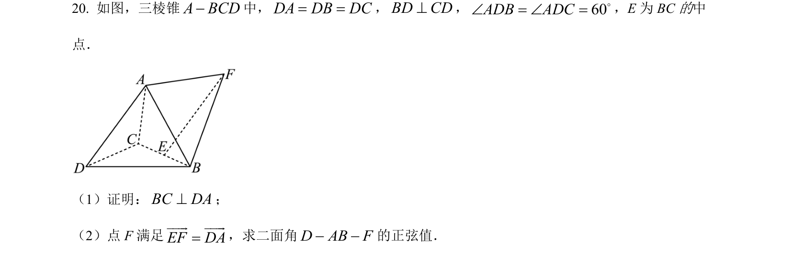
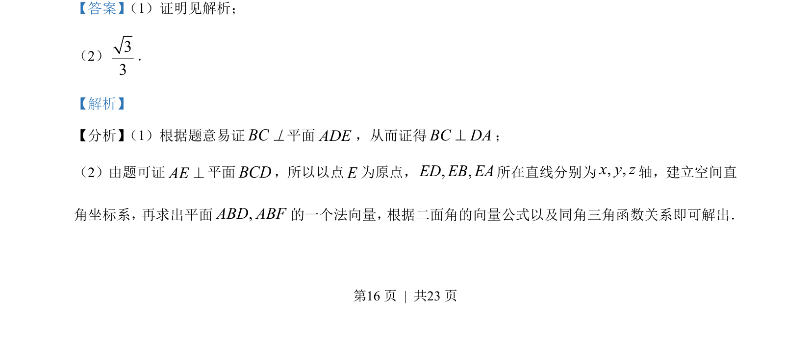
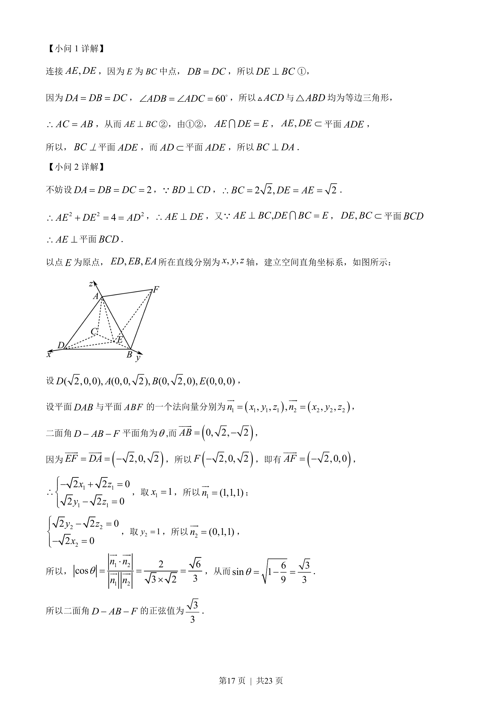

## 题面

## 摘要

本题考查线线垂直证明及利用空间向量求二面角的正弦值。

## 关联考点

- [[1086-线面垂直的判定与性质|线面垂直判定与性质]]
- [[399-空间向量坐标表示|空间直角坐标系]]
- [[1192-二面角的向量求法|二面角的向量求法]]

## 答案与解析

> 📄 原 PDF 第 16 页：`素材/真题/吉林/2008-2024·（吉林）数学高考真题/2023年高考数学试卷（新课标Ⅱ卷）（解析卷）.pdf`

<!-- 题干文本-start -->
## 题干文本
20. 如图，三棱锥A BCD中，DA DB DC= =，BD CD^， 60ADB ADCÐ = Ð =o，E为 BC的中
点．
  
（1）证明：BC DA^；
（2）点 F满足EFDA=rr
，求二面角D AB F 的正弦值．
<!-- 题干文本-end -->

<!-- 解析文本-start -->
## 解析文本
【答案】 （1）证明见解析；    
（2）33
．
【解析】
【分析】 （1）根据题意易证BC^平面ADE，从而证得BC DA^；
（2）由题可证^AE平面BCD，所以以点E为原点，, ,ED EB EA所在直线分别为, ,x y z轴，建立空间直
角坐标系， 再求出平面,ABD ABF的一个法向量， 根据二面角的向量公式以及同角三角函数关系即可解出．
<!-- 解析文本-end -->
