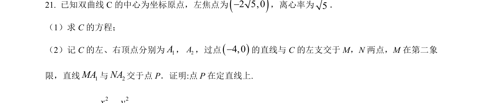
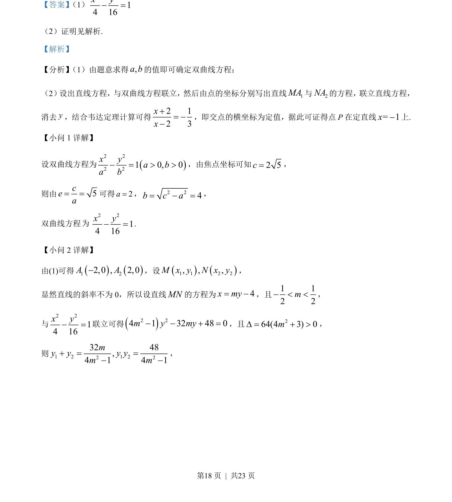
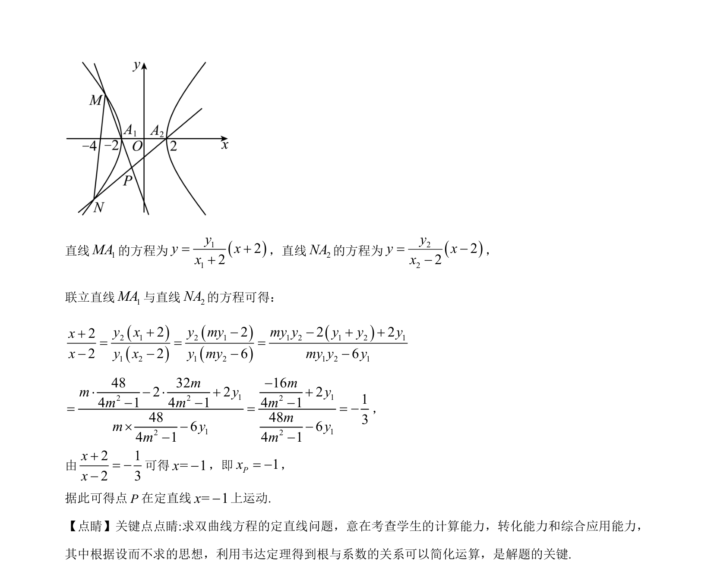

## 题面

## 摘要

本题主要考查双曲线标准方程的求解以及利用直线与双曲线联立，结合韦达定理证明动直线交点在定直线上。

## 关联考点

- [[733-双曲线的标准方程与几何性质|双曲线的标准方程与几何性质]]
- [[1006-直线与圆锥曲线的位置关系|直线与圆锥曲线的位置关系]]
- [[234-韦达定理-初中|韦达定理]]
- [[822-定值定点问题|定值定点问题]]

## 答案与解析

> 📄 原 PDF 第 18 页：`素材/真题/吉林/2008-2024·（吉林）数学高考真题/2023年高考数学试卷（新课标Ⅱ卷）（解析卷）.pdf`
