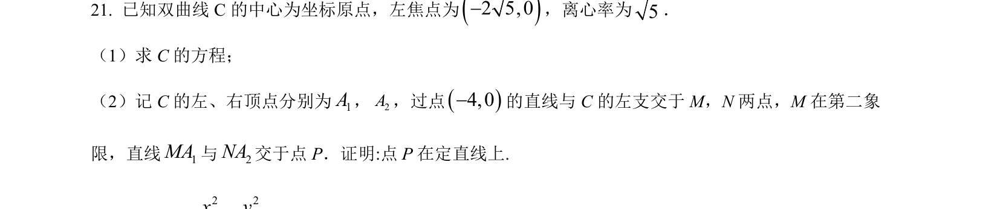
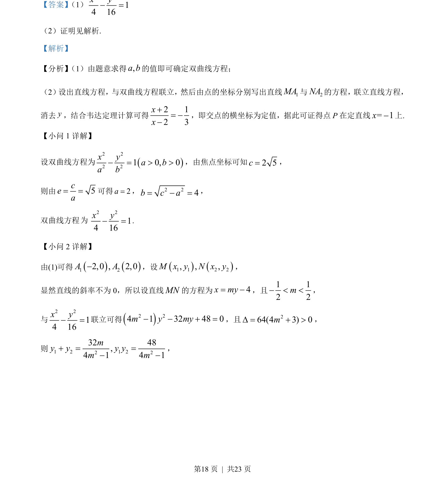
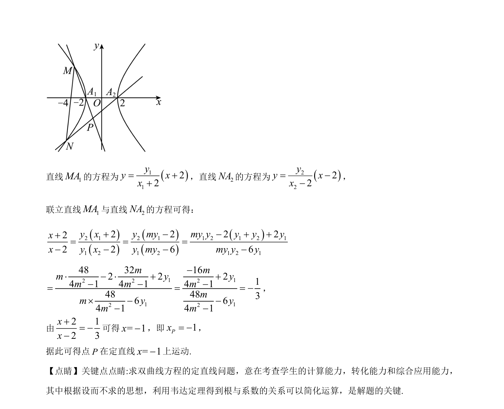

## 题面

## 摘要

本题主要考查双曲线标准方程的求解以及利用直线与双曲线联立，结合韦达定理证明动直线交点在定直线上。

## 关联考点

- [[733-双曲线的标准方程与几何性质|双曲线的标准方程与几何性质]]
- [[1006-直线与圆锥曲线的位置关系|直线与圆锥曲线的位置关系]]
- [[234-韦达定理-初中|韦达定理]]
- [[822-定值定点问题|定值定点问题]]

## 答案与解析

> 📄 原 PDF 第 18 页：`素材/真题/吉林/2008-2024·（吉林）数学高考真题/2023年高考数学试卷（新课标Ⅱ卷）（解析卷）.pdf`

<!-- 题干文本-start -->
## 题干文本
21. 已知双曲线 C的中心为坐标原点，左焦点为2 5,0，离心率为5．
（1）求 C的方程；
（2）记 C的左、右顶点分别为1A，2A，过点4,0的直线与 C的左支交于 M，N两点，M 在第二象
限，直线1MA与2NA交于点 P．证明:点P在定直线上.
<!-- 题干文本-end -->

<!-- 解析文本-start -->
## 解析文本
【答案】 （1）
2 214 16x y =    
（2）证明见解析.
【解析】
【分析】 （1）由题意求得,a b的值即可确定双曲线方程；
（2）设出直线方程，与双曲线方程联立，然后由点的坐标分别写出直线1MA与2NA的方程， 联立直线方程，
消去y，结合韦达定理计算可得2 12 3xx= 
，即交点的横坐标为定值，据此可证得点P在定直线= 1x上.
【小问 1 详解】
设双曲线方程为2 22 21 0, 0x ya ba b = > >，由焦点坐标可知2 5c=，
则由5cea= =可得2a=， 2 24b c a=  =，
双曲线方程
2 214 16x y =.
【小问 2 详解】
由(1)可得1 22,0 , 2,0A A，设1 1 2 2, , ,M x y N x y，
显然直线的斜率不为 0，所以设直线MN的方程为4x my= ，且1 12 2m < <，
与
2 214 16x y =联立可得2 24 1 32 48 0m y my   =，且 264(4 3) 0mD =  >，
则1 2 1 22 232 48,4 1 4 1my y y ym m = = 
，
为
<!-- 解析文本-end -->
