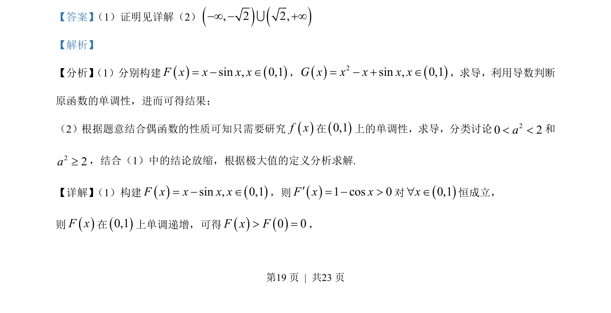
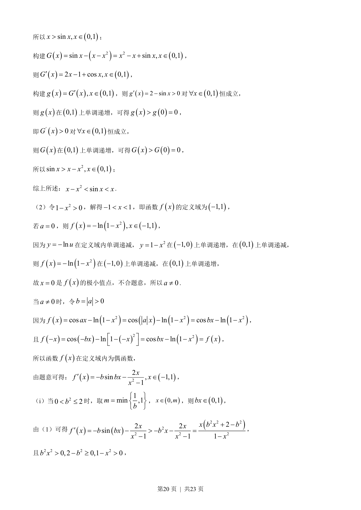
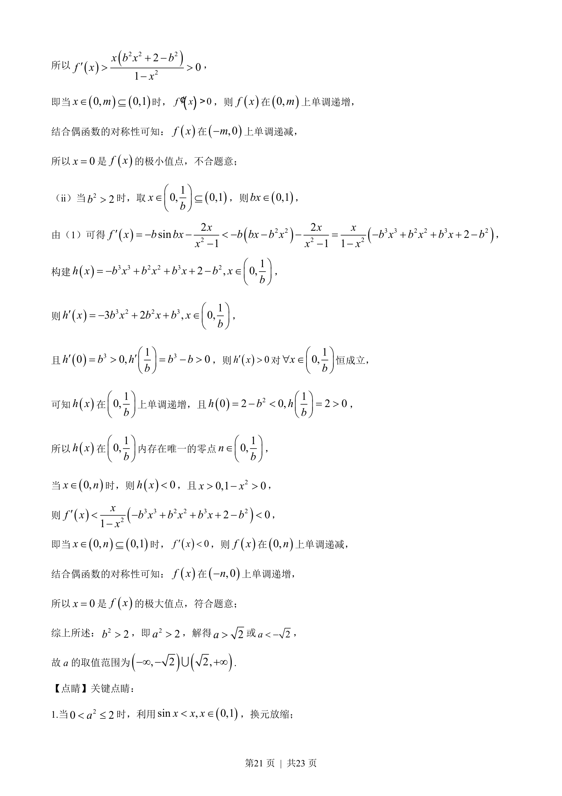
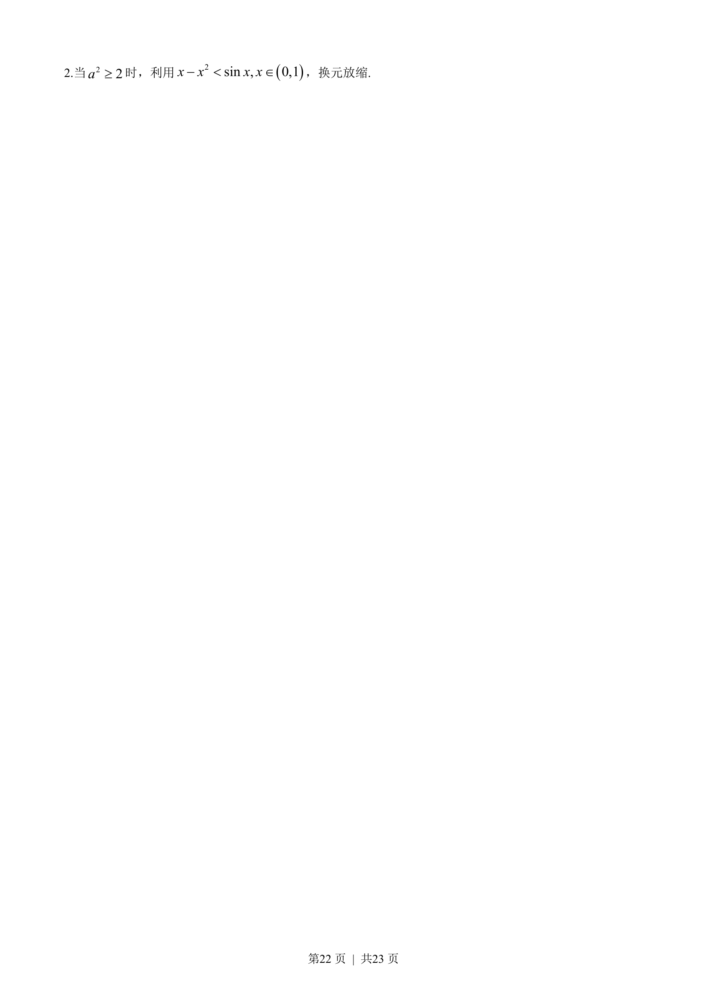

## 题面

## 摘要

本题主要考查利用导数证明不等式以及已知函数的极值点求参数取值范围，涉及导数研究单调性和分类讨论。

## 关联考点

- [[425-反函数导数|导数]]
- [[极值点]]
- [[083-不等式|不等式]]
- [[424-参数分类讨论|分类讨论]]

## 答案与解析

> 📄 原 PDF 第 19 页：`素材/真题/吉林/2008-2024·（吉林）数学高考真题/2023年高考数学试卷（新课标Ⅱ卷）（解析卷）.pdf`
