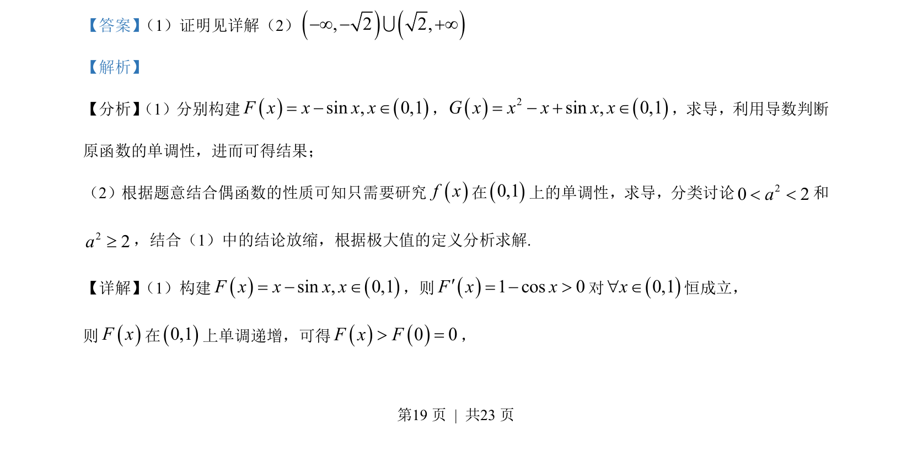
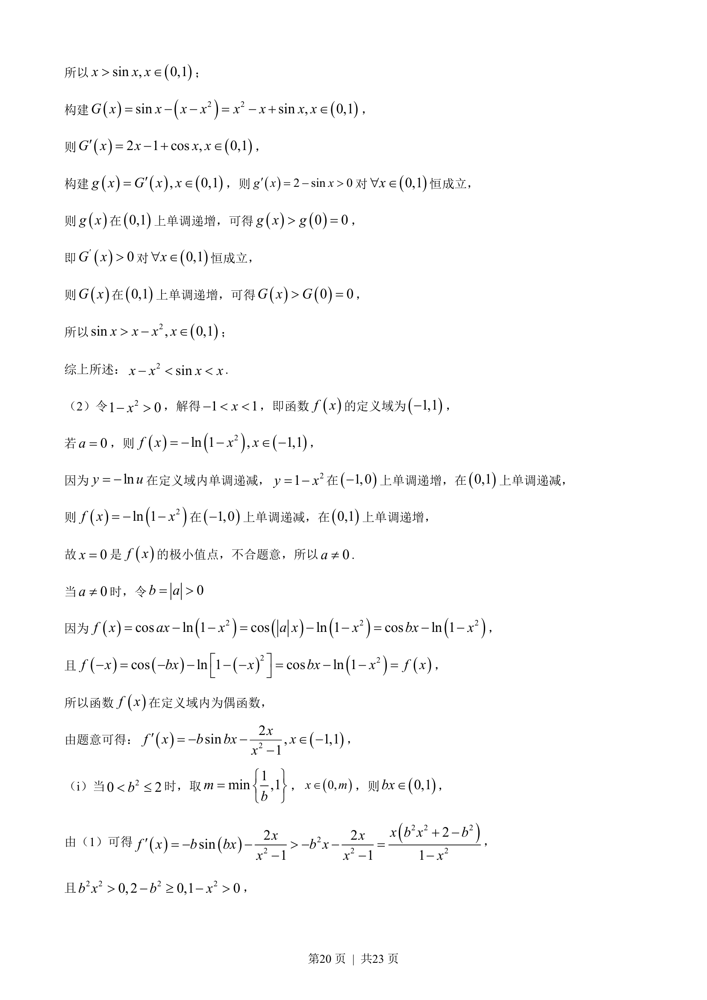
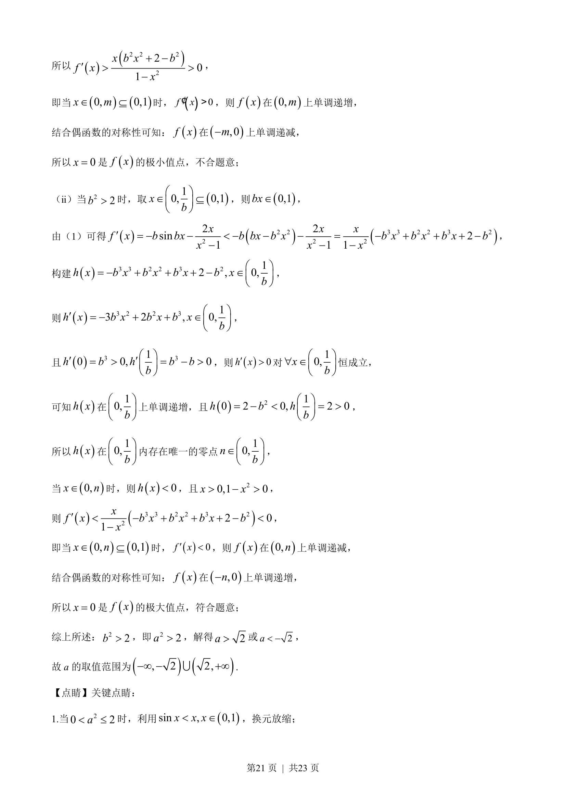
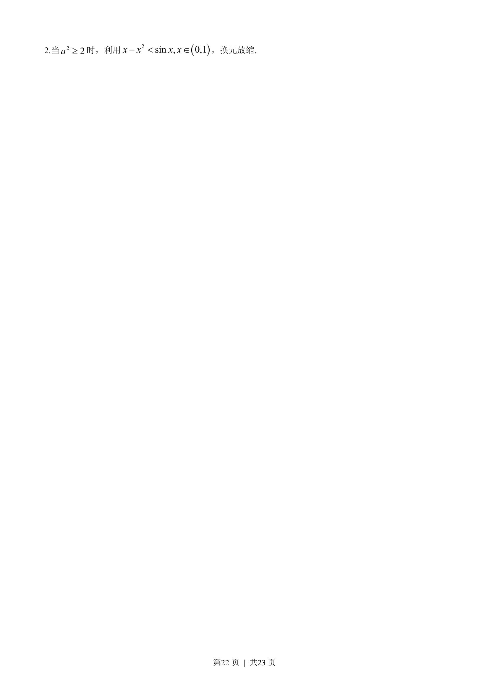

## 题面

## 摘要

本题主要考查利用导数证明不等式以及已知函数的极值点求参数取值范围，涉及导数研究单调性和分类讨论。

## 关联考点

- [[425-反函数导数|导数]]
- [[1173-极值点|极值点]]
- [[083-不等式|不等式]]
- [[424-参数分类讨论|分类讨论]]

## 答案与解析

> 📄 原 PDF 第 19 页：`素材/真题/吉林/2008-2024·（吉林）数学高考真题/2023年高考数学试卷（新课标Ⅱ卷）（解析卷）.pdf`

<!-- 题干文本-start -->
## 题干文本
22. （1）证明：当0 1x< <时，sinxxxx<<；
（2）已知函数2cosln1fxaxx=，若0x=是f x的极大值点，求 a 的取值范围．
<!-- 题干文本-end -->

<!-- 解析文本-start -->
## 解析文本
【答案】 （1）证明见详解（2）, 2 2,¥  ¥U
【解析】
【分析】 （1）分别构建sin , 0,1F x x x x=  Î，2sin , 0,1G x x x x x=   Î，求导，利用导数判断
原函数的单调性，进而可得结果；
（2）根据题意结合偶函数的性质可知只需要研究f x在0,1上的单调性，求导，分类讨论20 2a< <和
22a³，结合（1）中的结论放缩，根据极大值的定义分析求解.
【详解】 （1）构建sin , 0,1F x x x x=  Î，则1 cos 0F x x¢=  >对0,1x" Î恒成立，
则F x在0,1上单调递增，可得0 0F x F> =，
<!-- 解析文本-end -->
