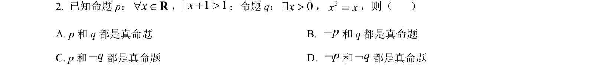
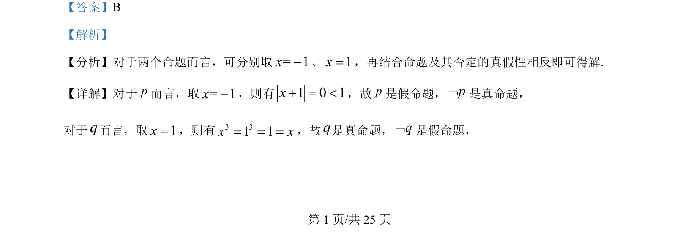
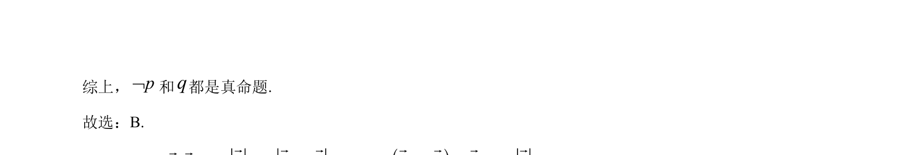

## 题面

## 摘要

本题考查通过赋值法判断命题真假及其否定的逻辑关系。

## 关联考点

- [[765-命题真假判断|命题真假判断]]
- [[762-命题的否定|命题的否定]]
- [[737-反例法|反例法]]

## 答案与解析

> 📄 原 PDF 第 1 页：`素材/真题/吉林/2008-2024·（吉林）数学高考真题/2024年高考数学试卷（新课标Ⅱ卷）（解析卷）.pdf`

<!-- 题干文本-start -->
## 题干文本
2. 已知命题 p：x" ÎR，| 1| 1x+ >；命题 q：0x$ >，3x x=，则（    ）
A. p 和 q 都是真命题 B. pØ和 q 都是真命题
C. p和qØ都是真命题 D. pØ和qØ都是真命题
<!-- 题干文本-end -->

<!-- 解析文本-start -->
## 解析文本
【答案】B
【解析】
【分析】对于两个命题而言，可分别取= 1x-、1x=，再结合命题及其否定的真假性相反即可得解.
【详解】对于p而言，取= 1x-，则有1 0 1x+ = <，故p是假命题，pØ是真命题，
对于q而言，取1x=，则有3 31 1x x= = =，故q是真命题，qØ是假命题，
<!-- 解析文本-end -->
