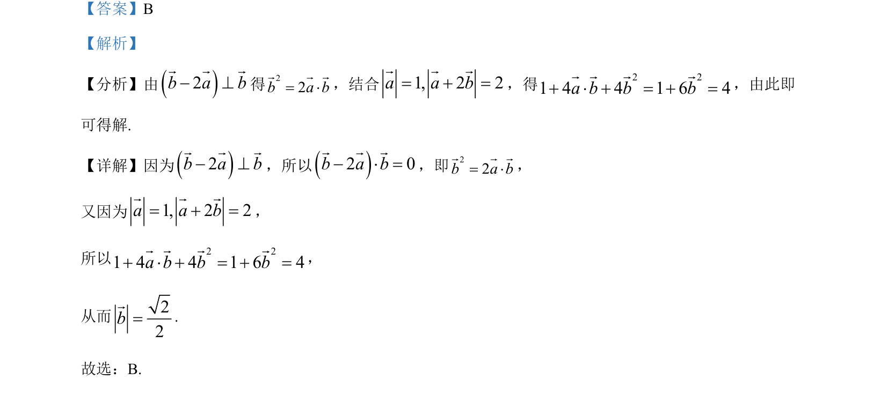

## 题面

## 摘要

向量垂直与模长计算，通过数量积为零和模长公式联立方程求向量模。

## 关联考点

- [[328-向量的数量积|数量积]]
- [[542-向量垂直|向量垂直]]
- [[752-向量模长|向量的模]]

## 答案与解析

> 📄 原 PDF 第 2 页：`素材/真题/吉林/2008-2024·（吉林）数学高考真题/2024年高考数学试卷（新课标Ⅱ卷）（解析卷）.pdf`
