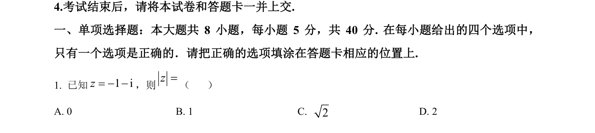
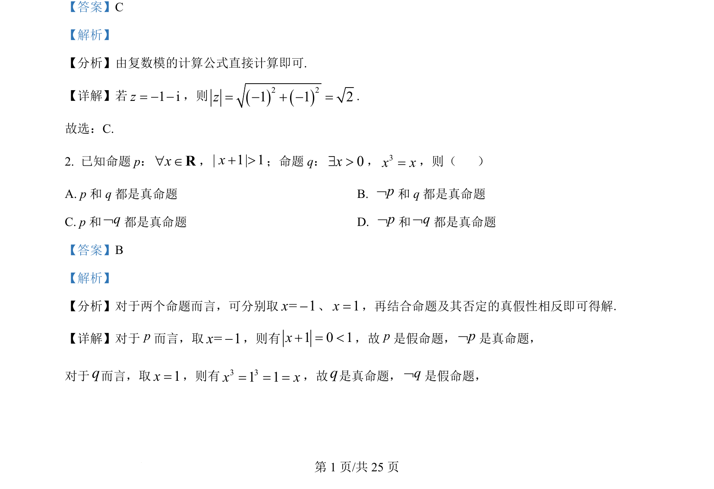

## 题面

## 摘要

该题考查频数分布表中中位数、比例、极差、平均值的计算与判断。

## 关联考点

- [[频数分布表]]
- [[180-中位数|中位数]]
- [[072-比与比例|比例]]
- [[极差]]
- [[055-平均数|平均值]]

## 答案与解析

> 📄 原 PDF 第 1 页：`素材/真题/吉林/2008-2024·（吉林）数学高考真题/2024年高考数学试卷（新课标Ⅱ卷）（解析卷）.pdf`
