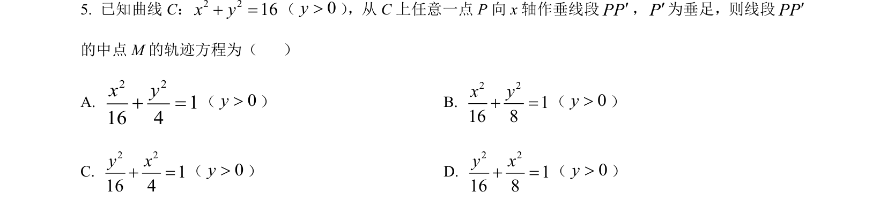
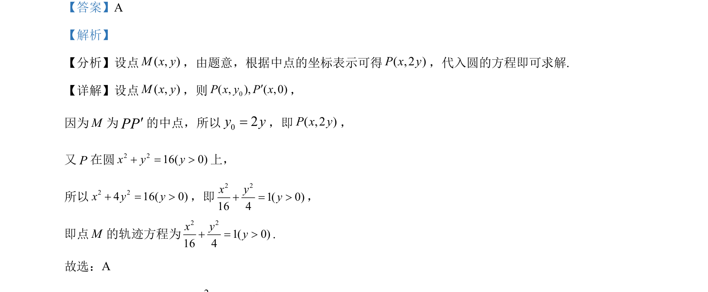

## 题面

## 摘要

求圆上动点相关中点的轨迹方程，利用中点公式转移代入得出椭圆方程。

## 关联考点

- [[376-圆锥曲线轨迹问题|轨迹方程]]
- [[635-中点坐标公式|中点坐标公式]]
- [[120-代入消元法|代入法]]

## 答案与解析

> 📄 原 PDF 第 3 页：`素材/真题/吉林/2008-2024·（吉林）数学高考真题/2024年高考数学试卷（新课标Ⅱ卷）（解析卷）.pdf`
