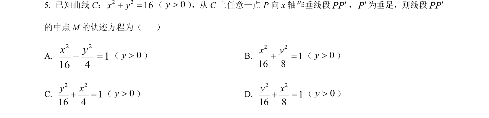
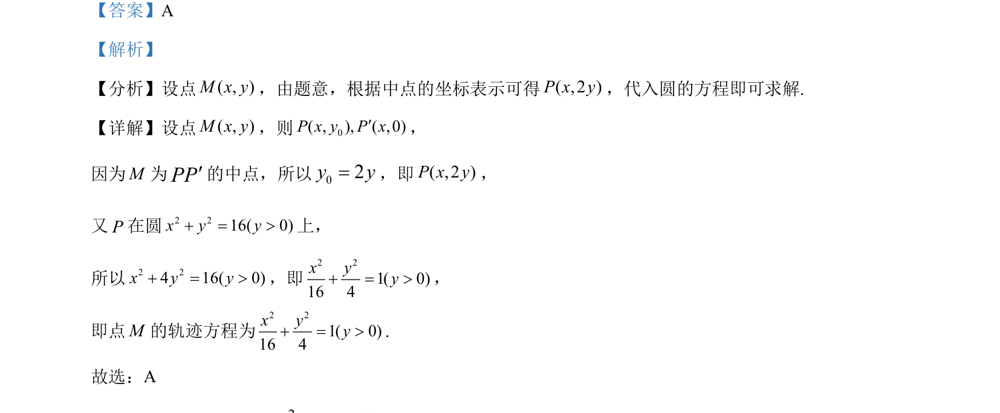

## 题面

## 摘要

求圆上动点相关中点的轨迹方程，利用中点公式转移代入得出椭圆方程。

## 关联考点

- [[376-圆锥曲线轨迹问题|轨迹方程]]
- [[635-中点坐标公式|中点坐标公式]]
- [[120-代入消元法|代入法]]

## 答案与解析

> 📄 原 PDF 第 3 页：`素材/真题/吉林/2008-2024·（吉林）数学高考真题/2024年高考数学试卷（新课标Ⅱ卷）（解析卷）.pdf`

<!-- 题干文本-start -->
## 题干文本
5. 已知曲线 C：2 216x y+ =（0y>） ，从C上任意一点 P向 x轴作垂线段PP¢，P¢为垂足，则线段PP¢
的中点 M 的轨迹方程为（    ）
A. 
2 2116 4x y+ =（0y>） B. 
221168xy+=（0y>）
C. 
2 2116 4y x+ =（0y>） D. 
221168yx+=（0y>）
<!-- 题干文本-end -->

<!-- 解析文本-start -->
## 解析文本
【答案】A
【解析】
【分析】设点( , )M x y，由题意，根据中点的坐标表示可得( ,2 )P x y，代入圆的方程即可求解.
【详解】设点( , )M x y，则 0( , ), ( ,0)P x y P x¢，
因为M为PP¢的中点，所以02y y=，即( ,2 )P x y，
又P在圆2 216( 0)x y y+ = >上，
所以2 24 16( 0)x y y+ = >，即
2 21( 0)16 4x yy+ = >，
即点M的轨迹方程为
2 21( 0)16 4x yy+ = >.
故选：A
<!-- 解析文本-end -->
