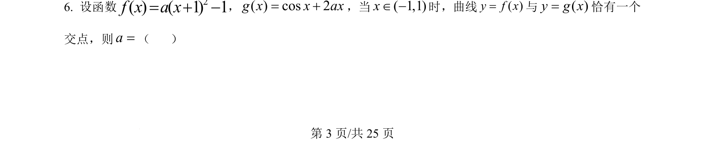
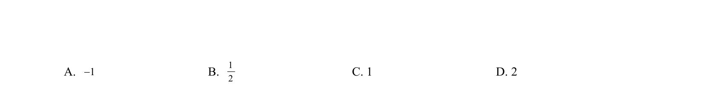
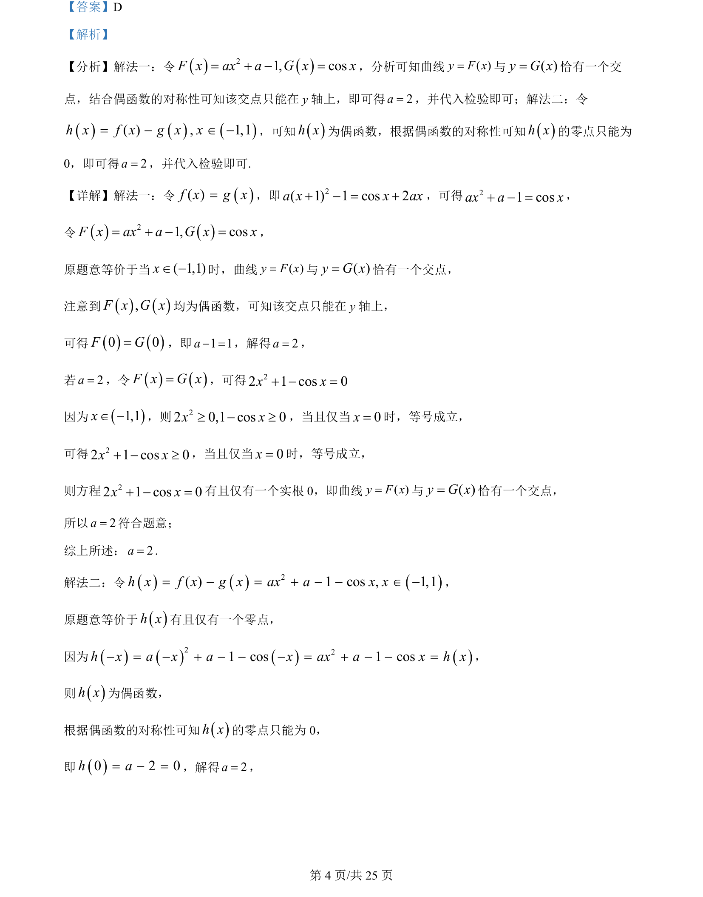
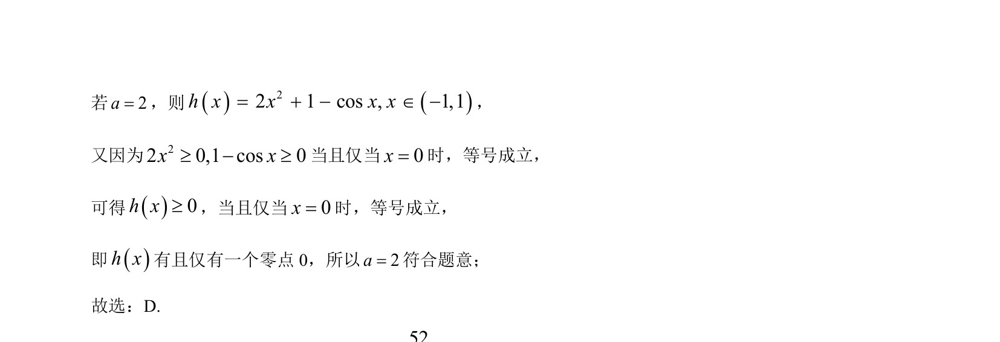

## 题面

## 摘要

f(x)=a(x+1)²-1，g(x)=cosx+2ax，当x∈(-1,1)时曲线y=f(x)与y=g(x)恰有一个交点，求参数a的取值。

## 关联考点

- [[188-函数概念|函数]]
- [[288-函数零点|零点]]
- [[721-参数取值范围|参数取值范围]]
- [[898-数形结合|数形结合]]

## 答案与解析

> 📄 原 PDF 第 3 页：`素材/真题/吉林/2008-2024·（吉林）数学高考真题/2024年高考数学试卷（新课标Ⅱ卷）（解析卷）.pdf`
