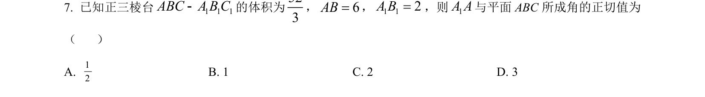
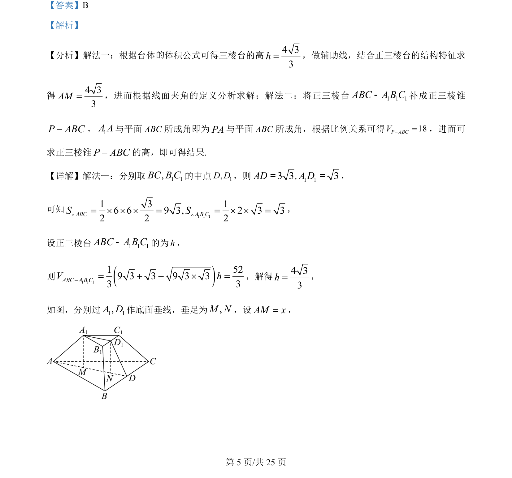

## 题面

## 摘要

考查正三棱台体积与线面角求解，包括直接套用台体公式或补形为三棱锥两种思路

## 关联考点

- [[台体体积]]
- [[353-空间角|线面角]]
- [[正三棱台]]
- [[几何补形]]

## 答案与解析

> 📄 原 PDF 第 5 页：`素材/真题/吉林/2008-2024·（吉林）数学高考真题/2024年高考数学试卷（新课标Ⅱ卷）（解析卷）.pdf`
