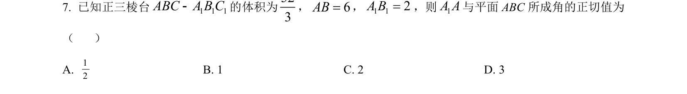
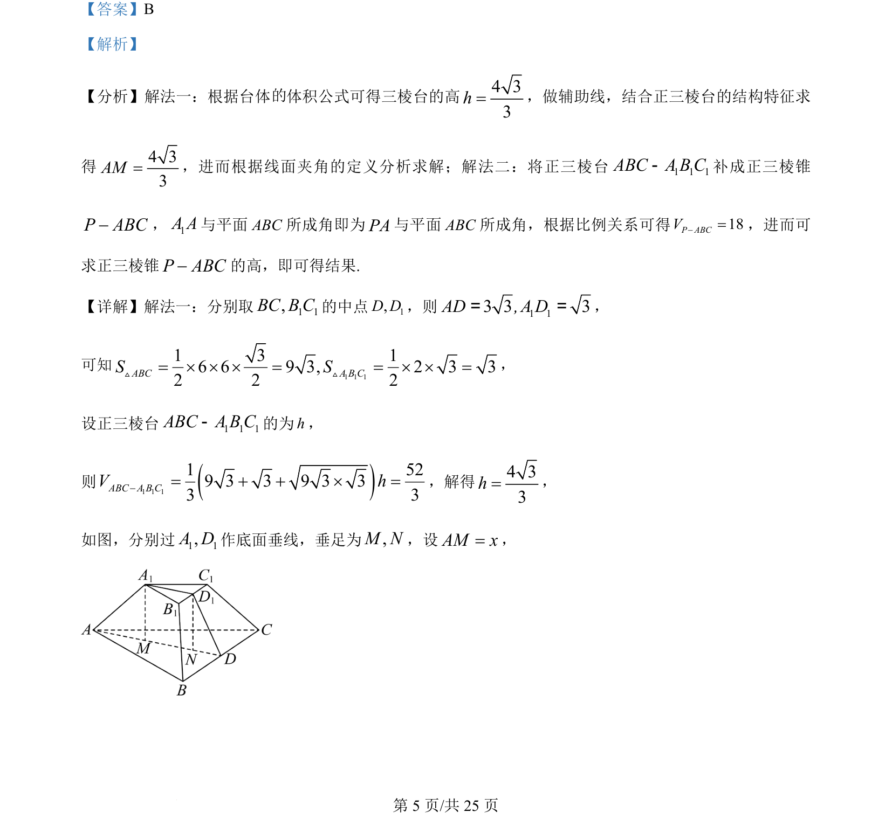
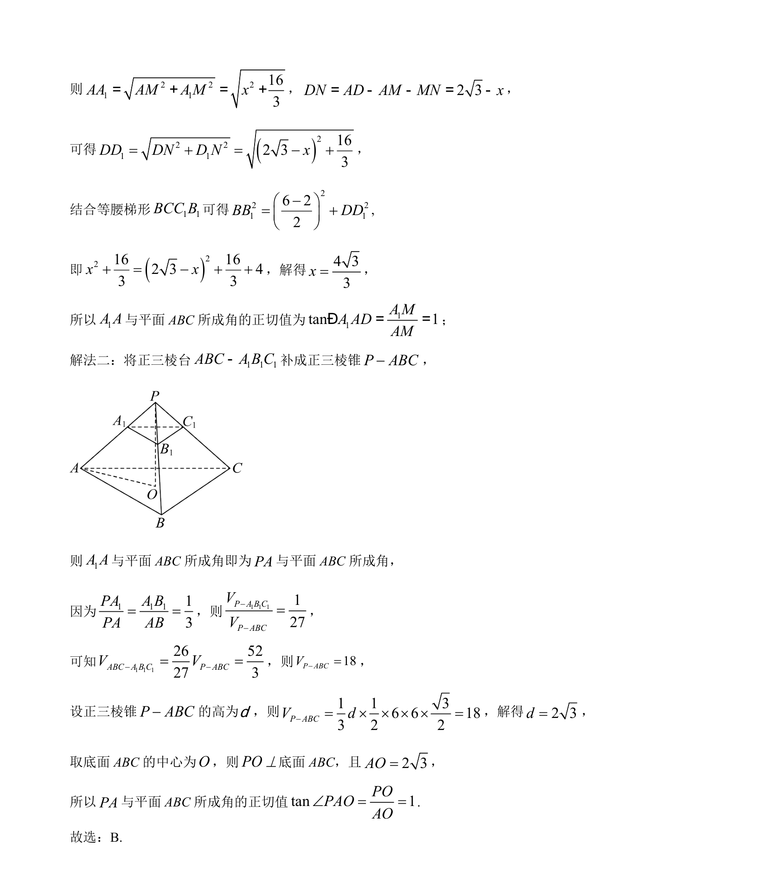

## 题面

## 摘要

考查正三棱台体积与线面角求解，包括直接套用台体公式或补形为三棱锥两种思路

## 关联考点

- [[739-台体体积|台体体积]]
- [[353-空间角|线面角]]
- [[953-正三棱台|正三棱台]]
- [[1194-几何补形|几何补形]]

## 答案与解析

> 📄 原 PDF 第 5 页：`素材/真题/吉林/2008-2024·（吉林）数学高考真题/2024年高考数学试卷（新课标Ⅱ卷）（解析卷）.pdf`

<!-- 题干文本-start -->
## 题干文本
7. 已知正三棱台 1 1 1ABC A B C-的体积为523
，6AB=，1 12A B=，则1A A与平面 ABC所成角的正切值为
（    ）
A. 12B. 1 C. 2 D. 3
<!-- 题干文本-end -->

<!-- 解析文本-start -->
## 解析文本
【答案】B
【解析】
【分析】解法一：根据台体 体积公式可得三棱台的高4 33h=，做辅助线，结合正三棱台的结构特征求
得4 33AM=，进而根据线面夹角的定义分析求解；解法二：将正三棱台 1 1 1ABC A B C-补成正三棱锥
-P ABC，1A A与平面 ABC 所成角即为PA与平面 ABC 所成角，根据比例关系可得18P ABCV-=，进而可
求正三棱锥-P ABC的高，即可得结果.
【详解】解法一：分别取 1 1,BC B C的中点1,D D，则 1 13 3 3AD , A D= =，
可知 1 1 11 3 16 6 9 3, 2 3 32 2 2ABC A B CS S= ´ ´ ´ = = ´ ´ =V V，
设正三棱台 1 1 1ABC A B C-的为h，
则()1 1 11 529 3 3 9 3 33 3ABC A B CV h-= + + ´ =，解得4 33h=，
如图，分别过1 1,A D作底面垂线，垂足为,M N，设AM x=，
的
<!-- 解析文本-end -->
