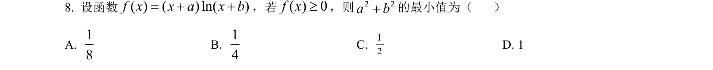

## 题面

## 摘要

函数定义域含参，结合对数与一次函数符号分析确定参数关系，利用二次函数或基本不等式求最值。

## 关联考点

- [[298-对数函数|对数函数性质]]
- [[424-参数分类讨论|分类讨论]]
- [[基本不等式求最值]]

## 答案与解析

> 📄 原 PDF 第 6 页：`素材/真题/吉林/2008-2024·（吉林）数学高考真题/2024年高考数学试卷（新课标Ⅱ卷）（解析卷）.pdf`
