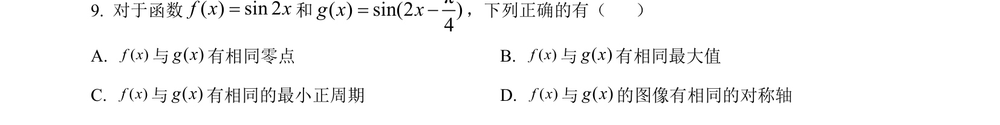
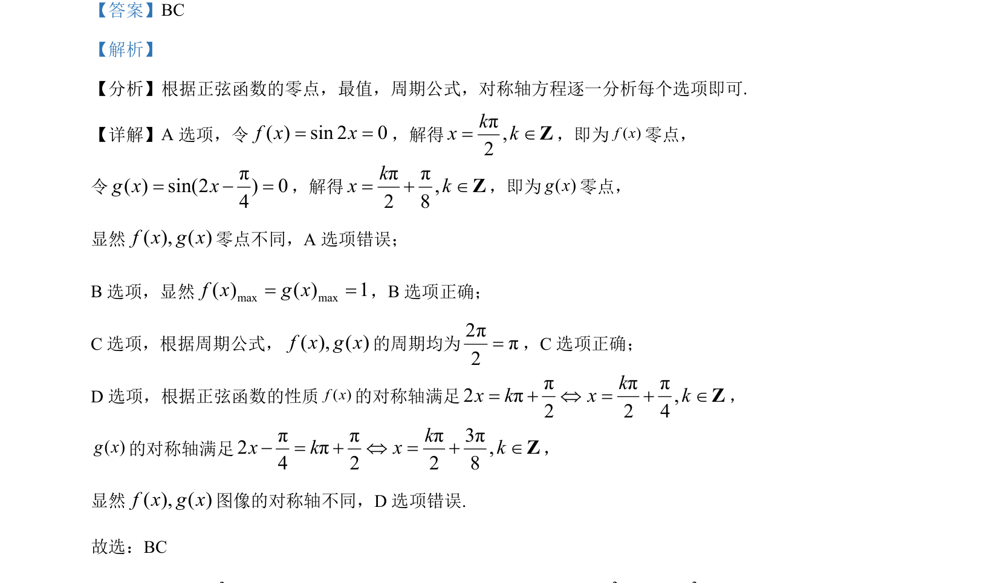

## 题面

## 摘要

本题通过比较两个正弦型函数的零点、最值、周期和对称轴，考查正弦函数的图像与性质。

## 关联考点

- [[288-函数零点|零点]]
- [[286-函数的最值|最值]]
- [[261-周期|周期]]
- [[174-轴对称图形|对称轴]]

## 答案与解析

> 📄 原 PDF 第 8 页：`素材/真题/吉林/2008-2024·（吉林）数学高考真题/2024年高考数学试卷（新课标Ⅱ卷）（解析卷）.pdf`
