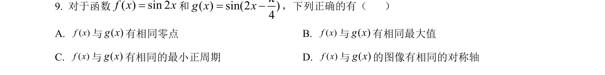
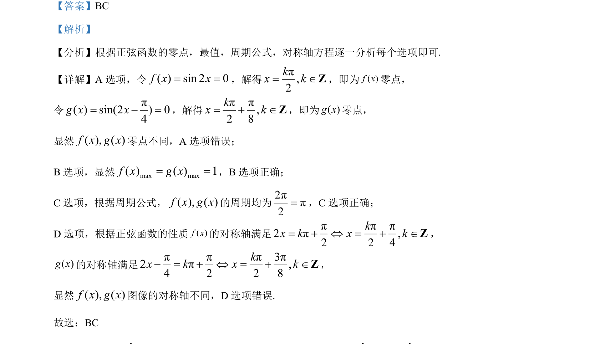

## 题面

## 摘要

本题通过比较两个正弦型函数的零点、最值、周期和对称轴，考查正弦函数的图像与性质。

## 关联考点

- [[288-函数零点|零点]]
- [[286-函数的最值|最值]]
- [[261-周期|周期]]
- [[174-轴对称图形|对称轴]]

## 答案与解析

> 📄 原 PDF 第 8 页：`素材/真题/吉林/2008-2024·（吉林）数学高考真题/2024年高考数学试卷（新课标Ⅱ卷）（解析卷）.pdf`

<!-- 题干文本-start -->
## 题干文本
9. 对于函数( ) sin 2f x x=和 π( ) sin(2 )4g x x= -，下列正确的有（    ）
A. ( )f x与( )g x有相同零点 B. ( )f x与( )g x有相同最大值
C. ( )f x与( )g x有相同的最小正周期 D. ( )f x与( )g x的图像有相同的对称轴
<!-- 题干文本-end -->

<!-- 解析文本-start -->
## 解析文本
【答案】BC
【解析】
【分析】根据正弦函数的零点，最值，周期公式，对称轴方程逐一分析每个选项即可.
【详解】A 选项，令( ) sin 2 0f x x= =，解得π,2kx k= ÎZ，即为( )f x零点，
令 π( ) sin(2 ) 04g x x= - =，解得ππ,2 8kx k= + ÎZ，即为( )g x零点，
显然( ), ( )f x g x零点不同，A 选项错误；
B选项，显然max max( ) ( ) 1f x g x= =，B选项正确；
C选项，根据周期公式，( ), ( )f x g x的周期均为2ππ2=，C选项正确；
D 选项，根据正弦函数的性质( )f x的对称轴满足 πππ2π,2 2 4kx k x k= + Û = + ÎZ，
( )g x的对称轴满足πππ3π2π,4 2 2 8kx k x k- = + Û = + ÎZ，
显然( ), ( )f x g x图像的对称轴不同，D 选项错误.
故选：BC
<!-- 解析文本-end -->
