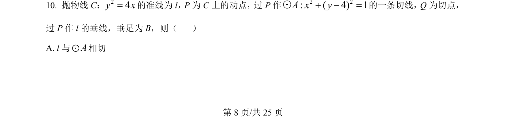
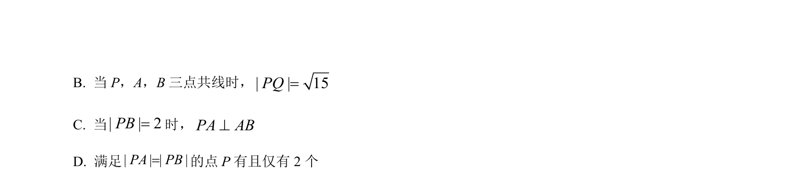
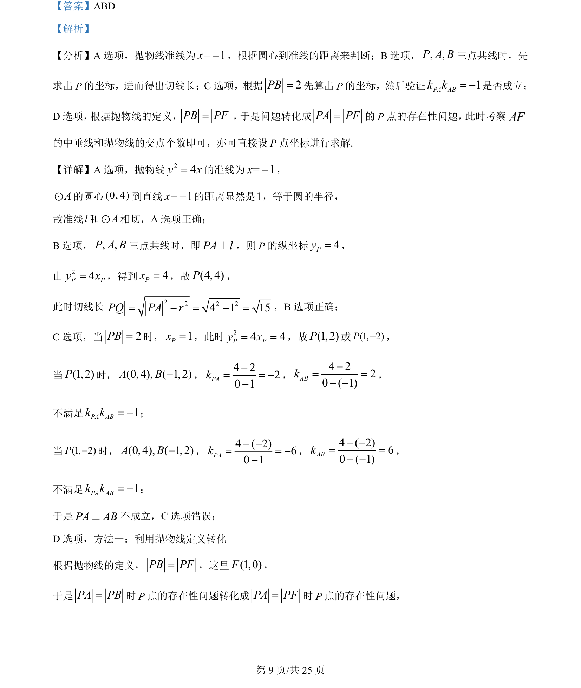
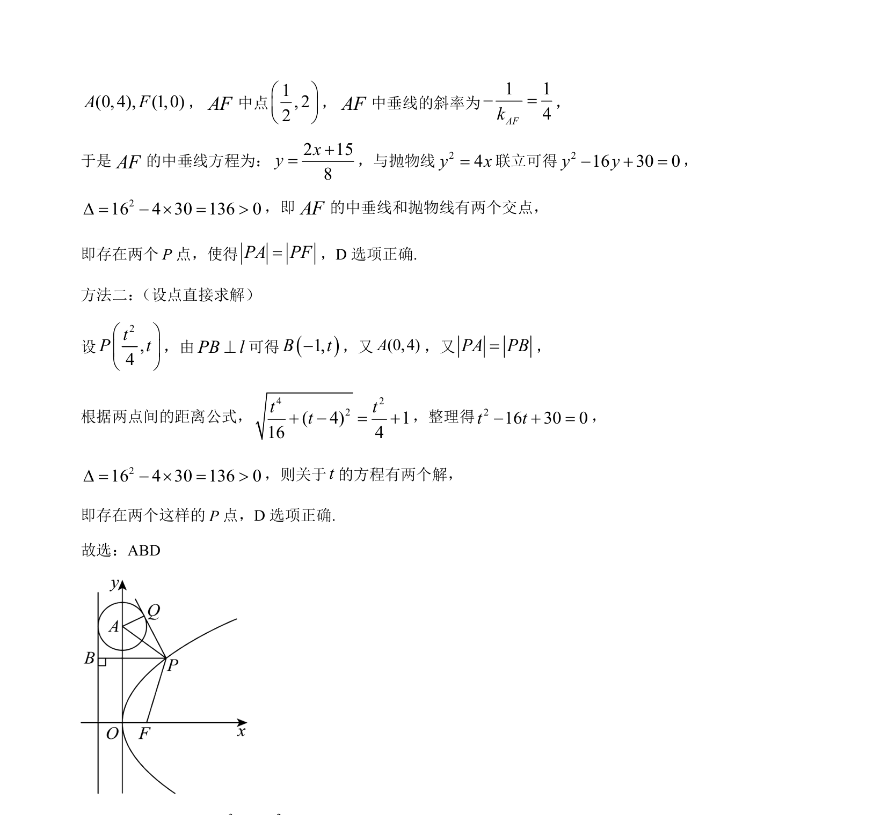

## 题面

## 摘要

考查抛物线与圆的综合应用，涉及准线、切线、三点共线及抛物线定义的转化。

## 关联考点

- [[378-抛物线几何性质|抛物线性质]]
- [[1004-直线与圆相切|直线与圆相切]]
- [[218-切线长定理|切线长]]
- [[227-抛物线|抛物线定义]]

## 答案与解析

> 📄 原 PDF 第 8 页：`素材/真题/吉林/2008-2024·（吉林）数学高考真题/2024年高考数学试卷（新课标Ⅱ卷）（解析卷）.pdf`
