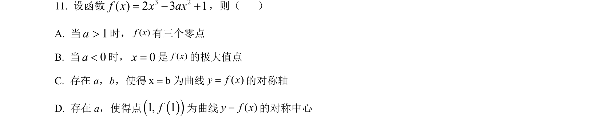
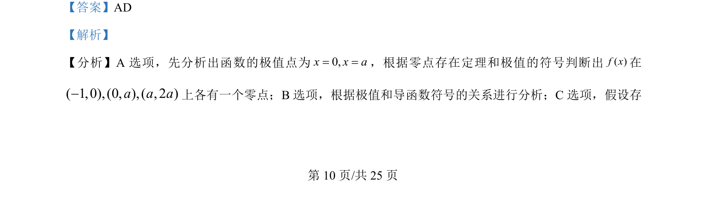
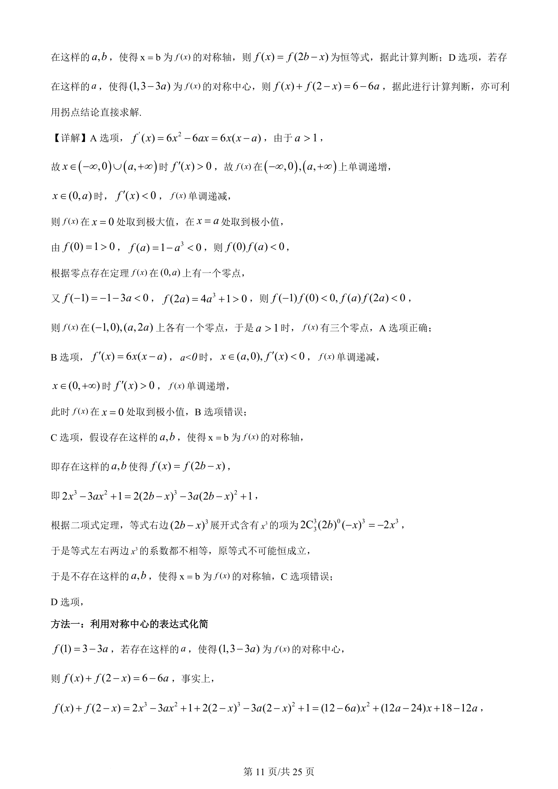
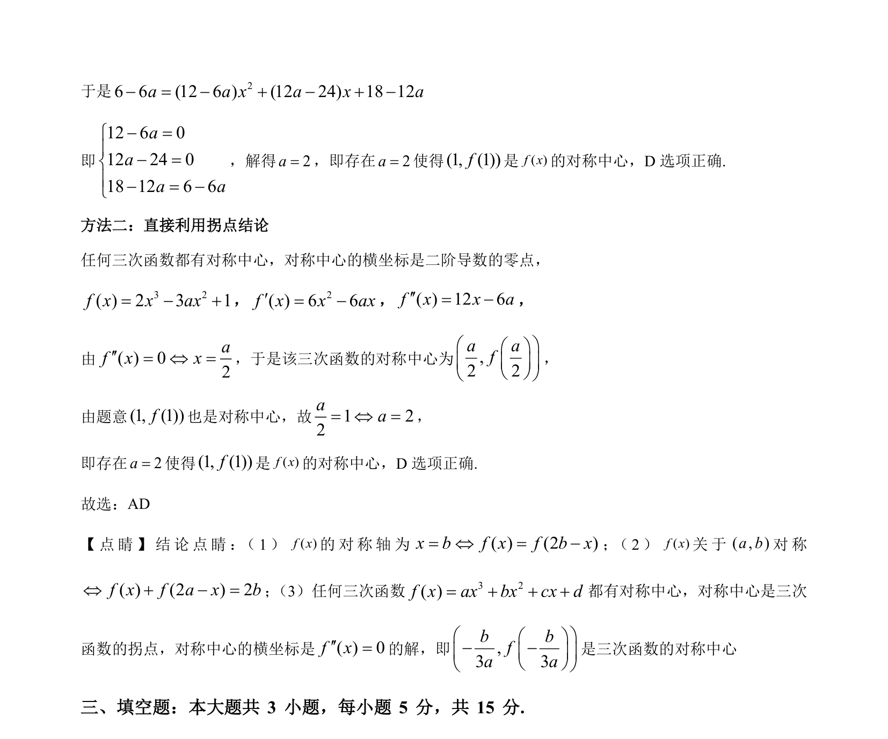

## 题面

## 摘要

f(x)=2x³-3ax²+1，综合判断关于零点个数、极值点、对称轴和对称中心的四个命题真假。

## 关联考点

- [[425-反函数导数|导数]]
- [[288-函数零点|函数零点]]
- [[286-函数的最值|极值]]
- [[174-轴对称图形|对称轴]]
- [[对称中心]]

## 答案与解析

> 📄 原 PDF 第 10 页：`素材/真题/吉林/2008-2024·（吉林）数学高考真题/2024年高考数学试卷（新课标Ⅱ卷）（解析卷）.pdf`
