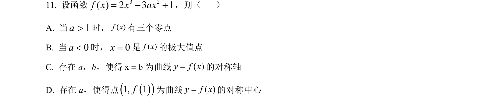
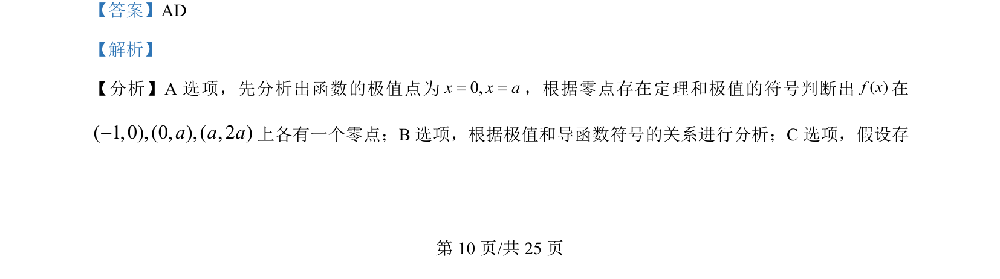
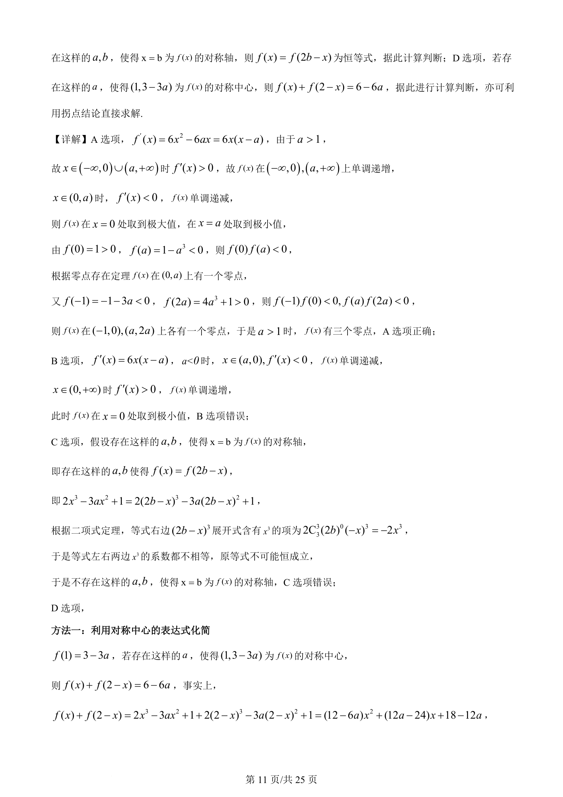
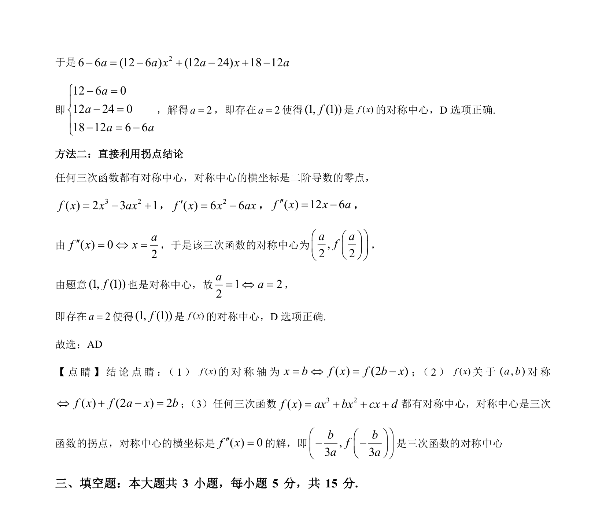

## 题面

## 摘要

f(x)=2x³-3ax²+1，综合判断关于零点个数、极值点、对称轴和对称中心的四个命题真假。

## 关联考点

- [[425-反函数导数|导数]]
- [[288-函数零点|函数零点]]
- [[286-函数的最值|极值]]
- [[174-轴对称图形|对称轴]]
- [[833-对称中心|对称中心]]

## 答案与解析

> 📄 原 PDF 第 10 页：`素材/真题/吉林/2008-2024·（吉林）数学高考真题/2024年高考数学试卷（新课标Ⅱ卷）（解析卷）.pdf`

<!-- 题干文本-start -->
## 题干文本
11. 设函数 3 2( ) 2 3 1f x x ax= - +，则（    ）
A. 当1a>时，( )f x有三个零点
B. 当0a<时，0x=是( )f x的极大值点
C. 存在 a，b，使得x b=为曲线( )y f x=的对称轴
D. 存在 a，使得点()()1, 1f为曲线( )y f x=的对称中心
<!-- 题干文本-end -->

<!-- 解析文本-start -->
## 解析文本
【答案】AD
【解析】
【分析】 A 选项，先分析出函数的极值点为0,xxa==，根据零点存在定理和极值的符号判断出( )f x在
( 1,0),(0, ),( , 2 )a a a-上各有一个零点；B 选项，根据极值和导函数符号的关系进行分析；C 选项，假设存
<!-- 解析文本-end -->
