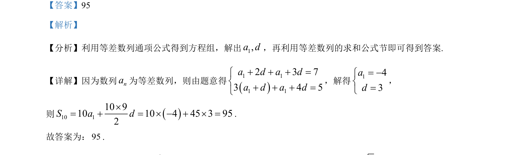

## 题面

## 摘要

该题考查等差数列的通项与求和，通过解方程组求首项和公差，再计算前10项和。

## 关联考点

- [[1063-等差数列通项公式|等差数列通项公式]]
- [[1059-等差数列求和公式|等差数列求和公式]]
- [[1110-解方程组|解方程组]]

## 答案与解析

> 📄 原 PDF 第 12 页：`素材/真题/吉林/2008-2024·（吉林）数学高考真题/2024年高考数学试卷（新课标Ⅱ卷）（解析卷）.pdf`

<!-- 题干文本-start -->
## 题干文本
12. 记nS为等差数列{ }na的前 n 项和，若3 47a a+ =，2 53 5a a+ =，则10S=________.
<!-- 题干文本-end -->

<!-- 解析文本-start -->
## 解析文本
【答案】95
【解析】
【分析】利用等差数列通项公式得到方程组，解出1,a d，再利用等差数列的求和公式节即可得到答案.
【详解】因为数列na为等差数列，则由题意得
1 11 12 3 73 4 5a d a da d a d+ + + =ìí+ + + =î
，解得143ad= -ìí=î
，
则 10 110 910 10 4 45 3 952S a d´= + = ´ - + ´ =.
故答案为：95.
<!-- 解析文本-end -->
