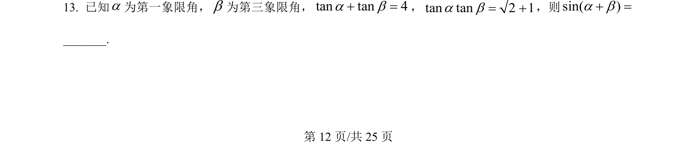
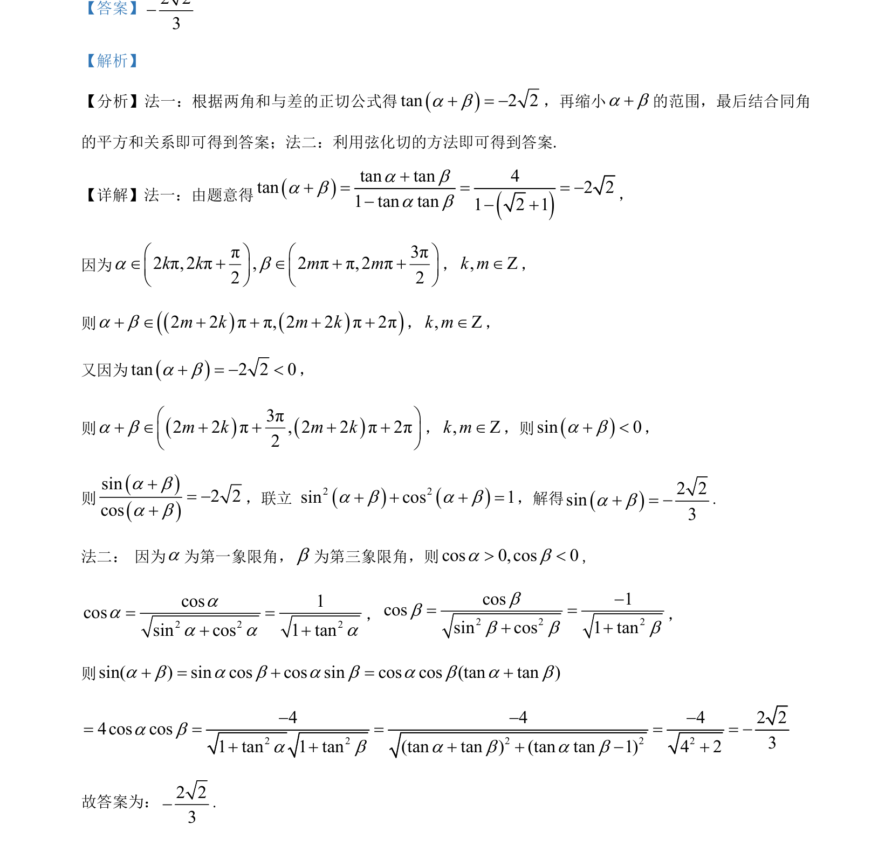

## 题面

## 摘要

本题主要考查两角和的正切公式应用、角的范围确定以及同角三角函数关系求解。

## 关联考点

- [[629-两角和与差的正切公式|两角和与差的正切公式]]
- [[741-同角三角函数基本关系|同角三角函数基本关系]]
- [[864-弦化切|弦化切]]
- [[1106-角度范围分析|角度范围分析]]

## 答案与解析

> 📄 原 PDF 第 12 页：`素材/真题/吉林/2008-2024·（吉林）数学高考真题/2024年高考数学试卷（新课标Ⅱ卷）（解析卷）.pdf`
