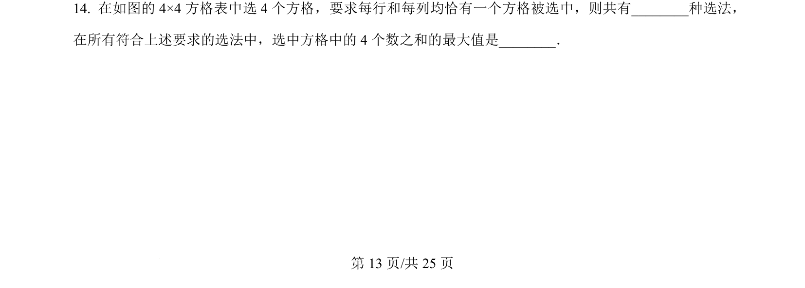
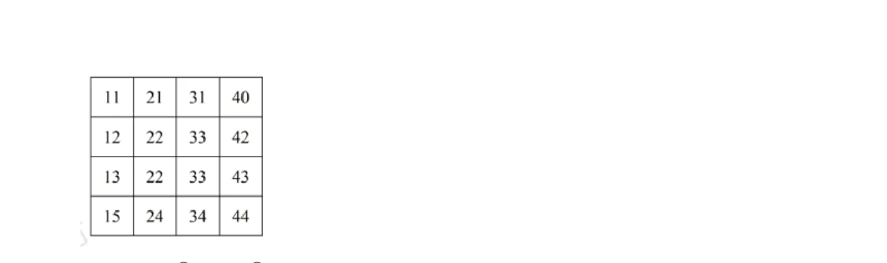
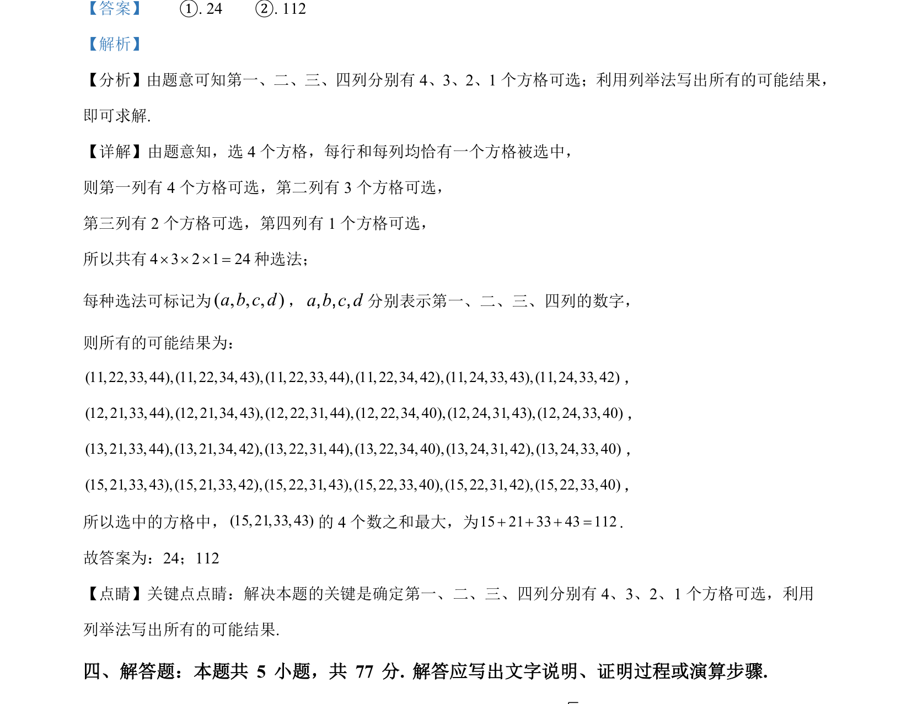

## 题面

## 摘要

本题通过分步乘法计数原理计算选法总数，并结合列举法求所有选法中数字之和的最大值。

## 关联考点

- [[031-搭配|排列组合]]
- [[703-列举法|列举法]]
- [[286-函数的最值|最值]]

## 答案与解析

> 📄 原 PDF 第 13 页：`素材/真题/吉林/2008-2024·（吉林）数学高考真题/2024年高考数学试卷（新课标Ⅱ卷）（解析卷）.pdf`
