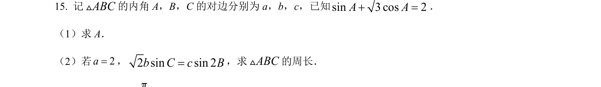
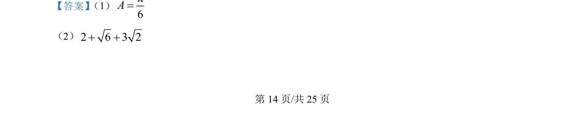
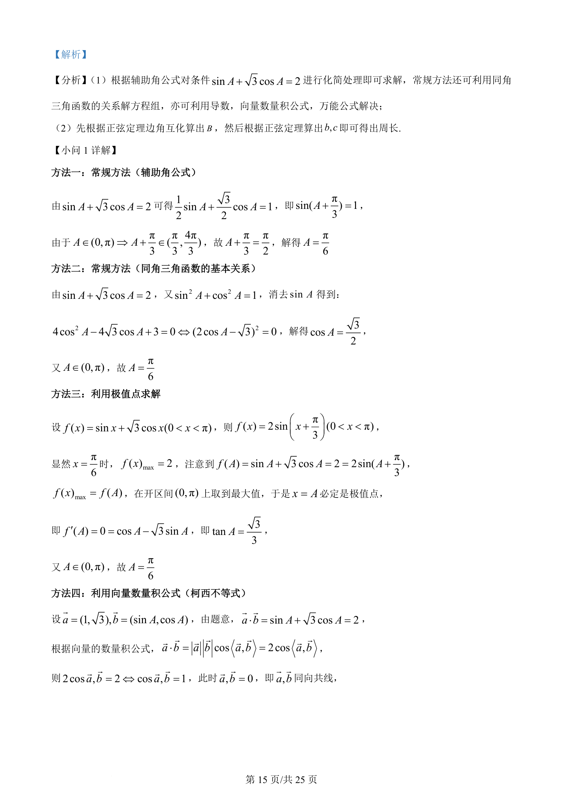
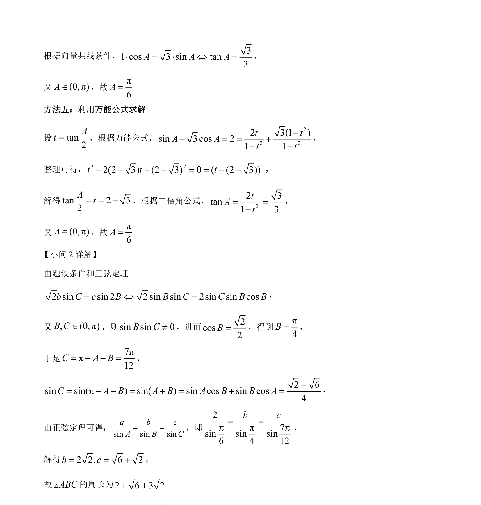

## 题面

## 摘要

本题主要考查解三角形，利用三角恒等变换求角A，运用正弦定理求边并计算周长。

## 关联考点

- [[辅助角公式]]
- [[293-同角三角函数关系|同角三角函数关系]]
- [[126-定理|正弦定理]]
- [[解三角形]]

## 答案与解析

> 📄 原 PDF 第 14 页：`素材/真题/吉林/2008-2024·（吉林）数学高考真题/2024年高考数学试卷（新课标Ⅱ卷）（解析卷）.pdf`
