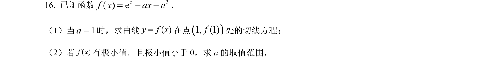
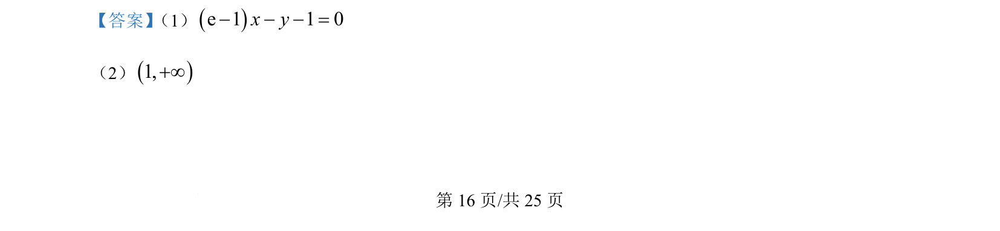
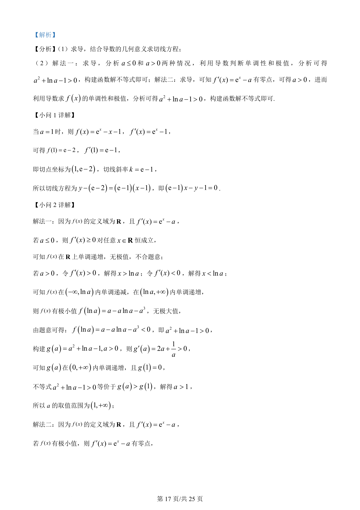
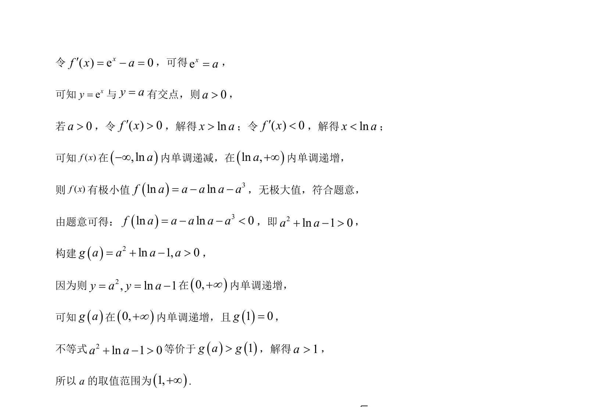

## 题面

## 摘要

利用导数求切线方程，通过讨论单调性与极值条件构造新函数解不等式求参数范围。

## 关联考点

- [[440-导数的几何意义|导数的几何意义]]
- [[705-利用导数研究函数的单调性|利用导数研究函数的单调性]]
- [[691-函数的极值|函数的极值]]
- [[926-构造法解不等式|构造法解不等式]]

## 答案与解析

> 📄 原 PDF 第 16 页：`素材/真题/吉林/2008-2024·（吉林）数学高考真题/2024年高考数学试卷（新课标Ⅱ卷）（解析卷）.pdf`
