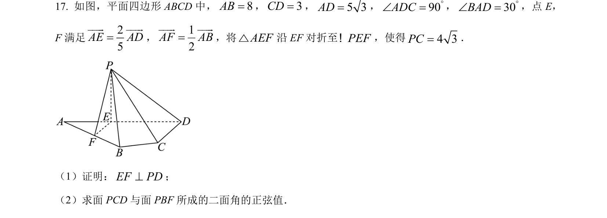
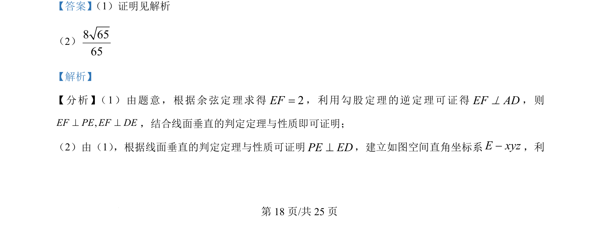
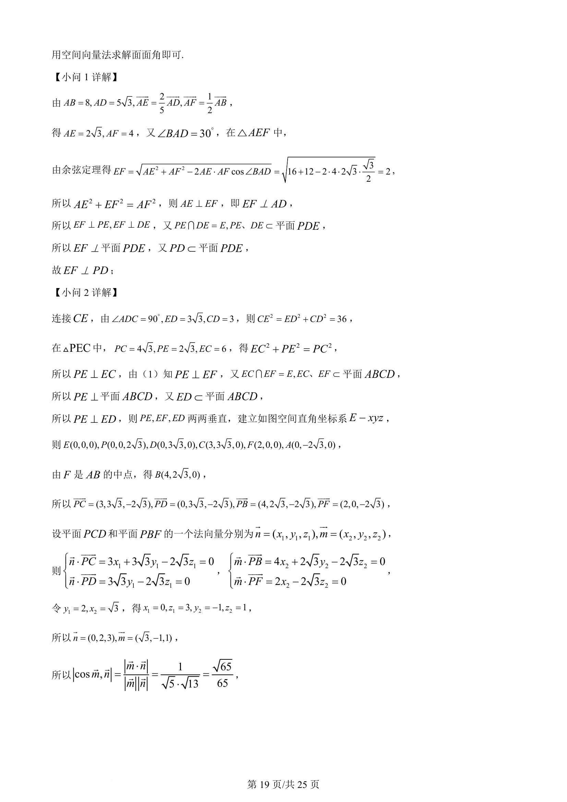
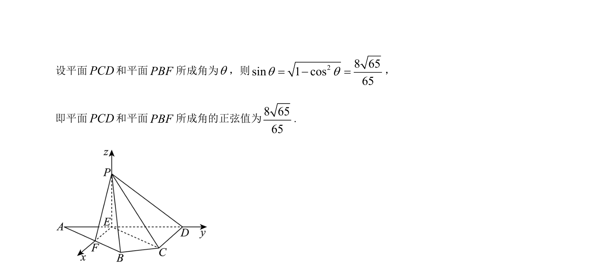

## 题面

## 摘要

立体几何题，考查线面垂直的判定与性质，以及用空间向量法求解二面角的正弦值。

## 关联考点

- [[126-定理|余弦定理]]
- [[线面垂直的判定与性质]]
- [[空间向量法]]
- [[353-空间角|二面角]]

## 答案与解析

> 📄 原 PDF 第 18 页：`素材/真题/吉林/2008-2024·（吉林）数学高考真题/2024年高考数学试卷（新课标Ⅱ卷）（解析卷）.pdf`
