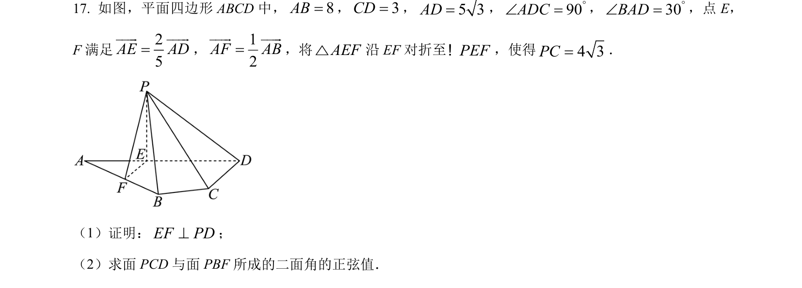
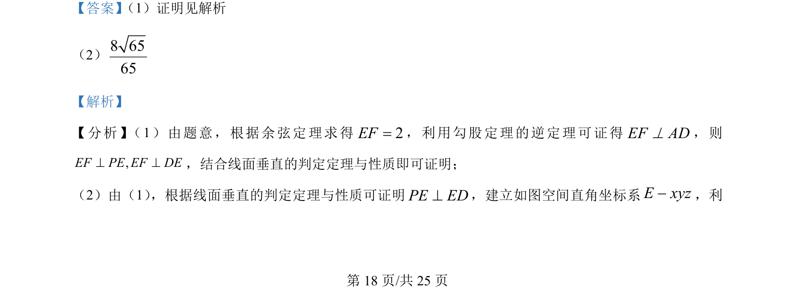
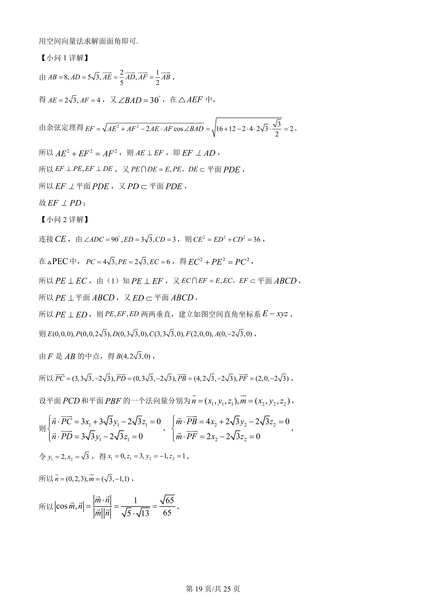
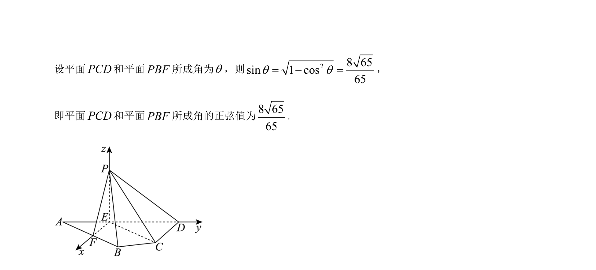

## 题面

## 摘要

立体几何题，考查线面垂直的判定与性质，以及用空间向量法求解二面角的正弦值。

## 关联考点

- [[126-定理|余弦定理]]
- [[1086-线面垂直的判定与性质|线面垂直的判定与性质]]
- [[579-空间向量法|空间向量法]]
- [[353-空间角|二面角]]

## 答案与解析

> 📄 原 PDF 第 18 页：`素材/真题/吉林/2008-2024·（吉林）数学高考真题/2024年高考数学试卷（新课标Ⅱ卷）（解析卷）.pdf`

<!-- 题干文本-start -->
## 题干文本
17. 如图，平面四边形 ABCD 中，8AB=，3CD=，5 3AD=，90ADC°Ð =，30BAD°Ð =，点 E，
F满足25AEAD=rr
，12AF AB= r  r
，将AEF△沿 EF对折至PEF!，使得4 3PC=．
（1）证明：EF PD^；
（2）求面 PCD 与面 PBF所成的二面角的正弦值．
<!-- 题干文本-end -->

<!-- 解析文本-start -->
## 解析文本
【答案】 （1）证明见解析    
（2）8 6565
【解析】
【分析】 （1）由题意，根据余弦定理求得2EF=，利用勾股定理的逆定理可证得EF AD^，则
,EF PE EF DE^ ^，结合线面垂直的判定定理与性质即可证明；
（2）由（1） ，根据线面垂直的判定定理与性质可证明PE ED^，建立如图空间直角坐标系E xyz-，利
<!-- 解析文本-end -->
