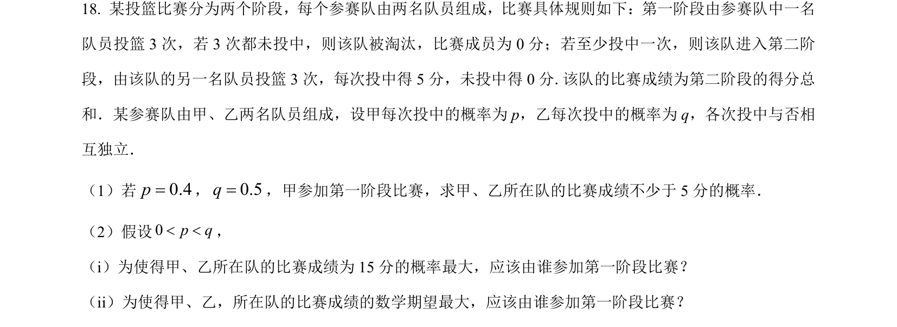
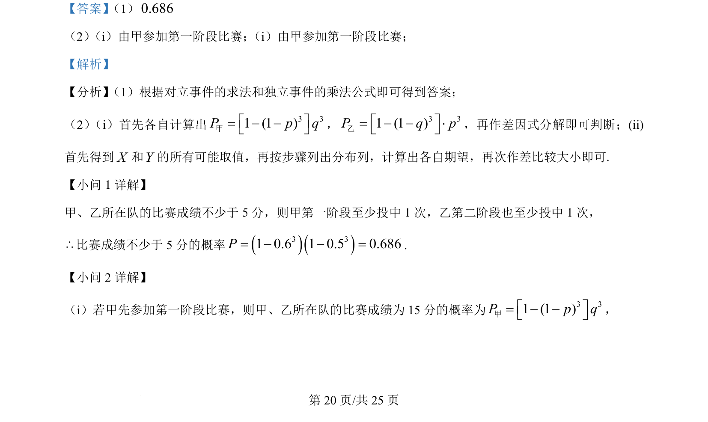
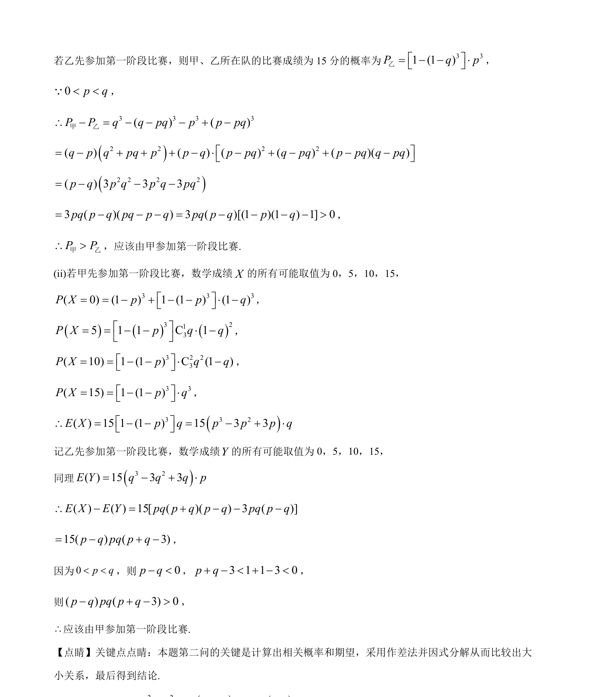

## 题面

## 摘要

本题通过比赛投篮情境考查独立事件概率计算、分布列与期望的求法及作差比较大小。

## 关联考点

- [[317-事件的关系运算|对立事件]]
- [[986-独立事件的乘法公式|独立事件的乘法公式]]
- [[1184-分布列与期望|分布列与期望]]
- [[1157-作差比较|作差比较]]

## 答案与解析

> 📄 原 PDF 第 20 页：`素材/真题/吉林/2008-2024·（吉林）数学高考真题/2024年高考数学试卷（新课标Ⅱ卷）（解析卷）.pdf`
